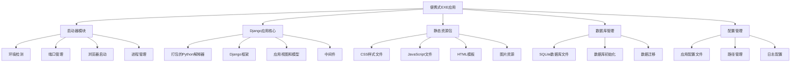
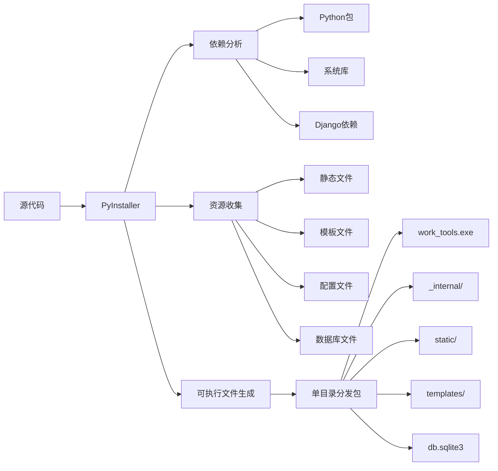

# 便携式EXE打包设计文档

## 概述

本设计文档描述了将Django工作工具应用程序打包为便携式Windows可执行文件的技术方案。该解决方案使用PyInstaller作为主要打包工具，确保应用程序可以在没有Python环境的Windows PC上独立运行，同时保持所有功能和数据持久性。

## 架构

### 整体架构图



### 打包架构



## 组件和接口

### 1. 启动器模块 (Launcher Module)

**职责**: 管理应用程序的启动流程和环境设置

```python
class ApplicationLauncher:
    def __init__(self):
        self.app_dir = self._get_app_directory()
        self.config = self._load_config()
        self.port = self._find_available_port()
    
    def start(self):
        """启动应用程序主流程"""
        pass
    
    def _setup_environment(self):
        """设置运行环境"""
        pass
    
    def _start_django_server(self):
        """启动Django开发服务器"""
        pass
    
    def _open_browser(self):
        """打开默认浏览器"""
        pass
```

**接口**:
- `start()`: 主启动方法
- `stop()`: 停止应用程序
- `restart()`: 重启应用程序
- `get_status()`: 获取运行状态

### 2. 路径管理器 (Path Manager)

**职责**: 管理所有文件路径，确保相对路径正确性

```python
class PathManager:
    def __init__(self, executable_path):
        self.base_dir = os.path.dirname(executable_path)
        self.static_dir = os.path.join(self.base_dir, 'static')
        self.templates_dir = os.path.join(self.base_dir, 'templates')
        self.db_path = os.path.join(self.base_dir, 'db.sqlite3')
        self.logs_dir = os.path.join(self.base_dir, 'logs')
        self.temp_dir = os.path.join(self.base_dir, 'temp_files')
    
    def ensure_directories(self):
        """确保所有必要目录存在"""
        pass
    
    def get_relative_path(self, path_type):
        """获取相对路径"""
        pass
```

### 3. 数据库管理器 (Database Manager)

**职责**: 管理SQLite数据库的初始化和迁移

```python
class DatabaseManager:
    def __init__(self, db_path, source_db_path=None):
        self.db_path = db_path
        self.source_db_path = source_db_path
    
    def initialize_database(self):
        """初始化数据库"""
        pass
    
    def copy_existing_database(self):
        """复制现有数据库文件"""
        pass
    
    def verify_database_integrity(self):
        """验证数据库完整性"""
        pass
```

### 4. 配置管理器 (Configuration Manager)

**职责**: 管理应用程序配置和设置

```python
class ConfigurationManager:
    def __init__(self, config_path):
        self.config_path = config_path
        self.config = {}
    
    def load_config(self):
        """加载配置文件"""
        pass
    
    def save_config(self):
        """保存配置文件"""
        pass
    
    def update_django_settings(self):
        """更新Django设置"""
        pass
```

### 5. 静态资源管理器 (Static Assets Manager)

**职责**: 管理静态文件的收集和服务

```python
class StaticAssetsManager:
    def __init__(self, static_root, templates_root):
        self.static_root = static_root
        self.templates_root = templates_root
    
    def collect_static_files(self):
        """收集静态文件"""
        pass
    
    def verify_assets(self):
        """验证资源完整性"""
        pass
```

## 数据模型

### 1. 应用程序配置模型

```python
@dataclass
class AppConfig:
    """应用程序配置数据模型"""
    app_name: str = "Work Tools"
    version: str = "1.0.0"
    port: int = 8000
    debug: bool = False
    auto_open_browser: bool = True
    database_path: str = "db.sqlite3"
    static_root: str = "static"
    templates_root: str = "templates"
    logs_directory: str = "logs"
    temp_directory: str = "temp_files"
    
    def to_dict(self) -> dict:
        """转换为字典格式"""
        pass
    
    @classmethod
    def from_dict(cls, data: dict) -> 'AppConfig':
        """从字典创建配置对象"""
        pass
```

### 2. 启动状态模型

```python
@dataclass
class LaunchStatus:
    """启动状态数据模型"""
    is_running: bool = False
    server_port: int = None
    server_url: str = None
    pid: int = None
    start_time: datetime = None
    error_message: str = None
    
    def update_status(self, **kwargs):
        """更新状态信息"""
        pass
```

### 3. 路径配置模型

```python
@dataclass
class PathConfig:
    """路径配置数据模型"""
    base_directory: str
    executable_path: str
    database_path: str
    static_directory: str
    templates_directory: str
    logs_directory: str
    temp_directory: str
    config_file_path: str
    
    def validate_paths(self) -> bool:
        """验证所有路径是否有效"""
        pass
    
    def create_missing_directories(self):
        """创建缺失的目录"""
        pass
```

## 正确性属性

*属性是应该在系统的所有有效执行中保持为真的特征或行为——本质上是关于系统应该做什么的正式声明。属性作为人类可读规范和机器可验证正确性保证之间的桥梁。*

### 属性1: 数据库文件复制一致性
*对于任何*现有的SQLite数据库文件，当首次启动应用程序时，复制到应用目录的数据库文件应该与源文件具有相同的内容和结构
**验证需求: Requirements 1.2**

### 属性2: 便携性保持功能完整性
*对于任何*Windows PC环境，当可执行文件被复制到新位置时，所有应用功能应该保持与原始位置相同的行为
**验证需求: Requirements 1.3**

### 属性3: 配置变更持久化
*对于任何*通过web界面进行的配置更改，这些更改应该立即保存到SQLite数据库中，并在应用重启后正确恢复
**验证需求: Requirements 2.1, 2.2**

### 属性4: 数据操作持久化
*对于任何*数据导入或修改操作，所有变更应该持久化到SQLite数据库文件中，并在后续访问时保持一致
**验证需求: Requirements 2.3**

### 属性5: 路径相对性保持
*对于任何*应用目录位置变更，应用程序应该继续使用相对于可执行文件的路径访问数据库和配置文件
**验证需求: Requirements 2.4**

### 属性6: 并发访问数据完整性
*对于任何*多用户同时访问场景，系统应该维护数据完整性并防止数据损坏
**验证需求: Requirements 2.5**

### 属性7: 静态资源服务完整性
*对于任何*web界面访问，所有CSS、JavaScript和模板文件应该从打包的静态文件目录正确加载和服务
**验证需求: Requirements 3.1, 3.2, 3.3**

### 属性8: 文件操作路径相对性
*对于任何*文件创建操作（临时文件、日志文件、下载文件），系统应该使用相对于可执行文件位置的路径
**验证需求: Requirements 4.1, 4.2, 4.5**

### 属性9: 配置和数据库路径相对性
*对于任何*配置文件和数据库访问，系统应该使用相对于可执行文件目录的路径
**验证需求: Requirements 4.3, 4.4**

### 属性10: 重复启动检测
*对于任何*应用程序已在运行的情况，再次启动应该检测到现有实例并打开浏览器而不启动重复服务器
**验证需求: Requirements 5.5**

### 属性11: Python模块依赖加载
*对于任何*Python模块导入，系统应该从打包的包目录加载所有依赖项
**验证需求: Requirements 6.3**

### 属性12: SQLite库打包使用
*对于任何*数据库操作，系统应该使用打包的SQLite库而不需要系统安装
**验证需求: Requirements 6.4**

### 属性13: 构建依赖检测完整性
*对于任何*构建脚本执行，系统应该自动检测所有Python依赖项并将其包含在打包中
**验证需求: Requirements 7.1**

### 属性14: 静态文件收集完整性
*对于任何*静态文件收集过程，系统应该将所有CSS、JavaScript和模板文件收集到适当的打包目录中
**验证需求: Requirements 7.2**

### 属性15: 构建输出完整性
*对于任何*可执行文件构建过程，系统应该创建包含所有必要组件的单文件或单目录分发包
**验证需求: Requirements 7.3**

## 错误处理

### 1. 启动错误处理

**错误类型**: 端口占用、权限不足、文件缺失
**处理策略**:
- 自动寻找可用端口
- 显示清晰的错误信息和解决建议
- 提供日志记录用于问题诊断

```python
class StartupErrorHandler:
    def handle_port_conflict(self, port):
        """处理端口冲突"""
        available_port = self._find_available_port(port + 1)
        return available_port
    
    def handle_permission_error(self, path):
        """处理权限错误"""
        error_msg = f"无法访问路径: {path}，请检查文件权限"
        self._log_error(error_msg)
        return error_msg
    
    def handle_missing_files(self, missing_files):
        """处理文件缺失"""
        error_msg = f"缺少必要文件: {', '.join(missing_files)}"
        self._log_error(error_msg)
        return error_msg
```

### 2. 数据库错误处理

**错误类型**: 数据库损坏、锁定、权限问题
**处理策略**:
- 数据库完整性检查
- 自动备份和恢复机制
- 优雅降级处理

```python
class DatabaseErrorHandler:
    def handle_database_corruption(self, db_path):
        """处理数据库损坏"""
        backup_path = f"{db_path}.backup"
        if os.path.exists(backup_path):
            shutil.copy2(backup_path, db_path)
            return True
        return False
    
    def handle_database_lock(self, db_path):
        """处理数据库锁定"""
        # 等待锁定释放或强制解锁
        pass
```

### 3. 文件系统错误处理

**错误类型**: 磁盘空间不足、路径无效、权限问题
**处理策略**:
- 磁盘空间检查
- 路径验证和修正
- 临时文件清理

```python
class FileSystemErrorHandler:
    def check_disk_space(self, path, required_space):
        """检查磁盘空间"""
        free_space = shutil.disk_usage(path).free
        return free_space >= required_space
    
    def validate_path(self, path):
        """验证路径有效性"""
        try:
            os.path.normpath(path)
            return True
        except Exception:
            return False
```

## 测试策略

### 单元测试方法

**测试范围**:
- 路径管理器功能测试
- 配置管理器测试
- 数据库管理器测试
- 启动器模块测试

**测试工具**: pytest, unittest
**测试覆盖率目标**: 85%以上

### 属性基础测试方法

**测试框架**: Hypothesis (Python属性基础测试库)
**测试配置**: 每个属性测试运行最少100次迭代
**测试标注**: 每个属性基础测试必须使用注释明确引用设计文档中的正确性属性

**属性测试要求**:
- 每个正确性属性必须由单个属性基础测试实现
- 测试必须使用以下格式标注: '**Feature: portable-exe-packaging, Property {number}: {property_text}**'
- 测试应该生成智能的测试数据，合理约束输入空间

### 集成测试方法

**测试场景**:
- 完整的打包流程测试
- 不同Windows环境兼容性测试
- 多用户并发访问测试
- 长时间运行稳定性测试

**测试环境**:
- Windows 10 (多个版本)
- Windows 11
- Windows Server 2019/2022
- 虚拟机环境测试

### 性能测试

**测试指标**:
- 启动时间 < 10秒
- 内存使用 < 200MB
- 响应时间 < 2秒
- 文件操作性能

**测试工具**: 
- 内存监控工具
- 性能分析器
- 负载测试工具

### 兼容性测试

**测试范围**:
- 不同Windows版本
- 不同硬件配置
- 不同安全软件环境
- 网络环境变化

**测试方法**:
- 自动化测试脚本
- 手动验证测试
- 用户接受测试