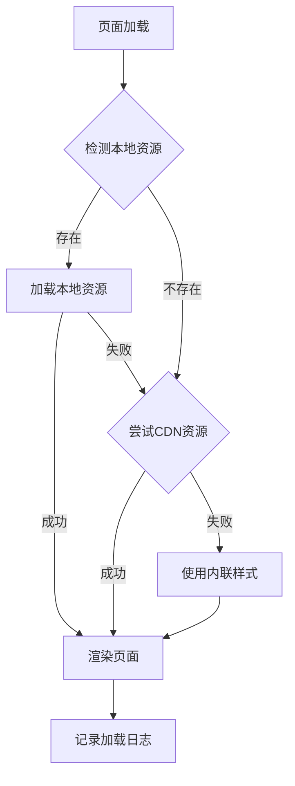

# 系统配置模块UI重新设计 - 设计文档

## 概述

本设计文档描述了系统配置模块UI重新设计的技术方案。核心目标是创建一个现代化、响应式、高性能的配置界面，采用"本地优先、CDN备选"的资源加载策略，确保在各种网络环境下都能稳定运行。

## 架构

### 整体架构

```
┌─────────────────────────────────────────────────────────────┐
│                      浏览器客户端                              │
├─────────────────────────────────────────────────────────────┤
│  ┌──────────────┐  ┌──────────────┐  ┌──────────────┐      │
│  │  HTML模板    │  │  CSS样式     │  │  JavaScript  │      │
│  │  引擎        │  │  加载器      │  │  交互逻辑    │      │
│  └──────────────┘  └──────────────┘  └──────────────┘      │
├─────────────────────────────────────────────────────────────┤
│                   资源加载策略层                              │
│  ┌──────────────────────────────────────────────────────┐  │
│  │  1. 检测本地资源 → 2. 尝试CDN → 3. 内联样式降级      │  │
│  └──────────────────────────────────────────────────────┘  │
├─────────────────────────────────────────────────────────────┤
│                    静态资源层                                │
│  ┌──────────────┐  ┌──────────────┐  ┌──────────────┐      │
│  │  本地资源    │  │  CDN资源     │  │  内联样式    │      │
│  │  (优先)      │  │  (备选)      │  │  (降级)      │      │
│  └──────────────┘  └──────────────┘  └──────────────┘      │
└─────────────────────────────────────────────────────────────┘
```

### 资源加载流程



## 组件和接口

### 1. 资源加载器 (ResourceLoader)

**职责**: 管理CSS和JavaScript资源的加载策略

**接口**:
```python
class ResourceLoader:
    def load_stylesheet(self, local_path: str, cdn_url: str, fallback_inline: str) -> str
    def load_script(self, local_path: str, cdn_url: str) -> str
    def check_resource_availability(self, path: str) -> bool
    def log_resource_status(self, resource: str, status: str) -> None
```

### 2. 模板标签 (Template Tags)

**职责**: 在Django模板中提供资源加载的便捷方法

**接口**:
```python
@register.simple_tag
def load_css(local_path, cdn_url=None, inline_css=None):
    """加载CSS资源，优先本地，备选CDN"""
    pass

@register.simple_tag  
def load_js(local_path, cdn_url=None):
    """加载JavaScript资源，优先本地，备选CDN"""
    pass
```

### 3. UI组件库 (UI Components)

**职责**: 提供统一的UI组件样式和交互

**组件清单**:
- 表单组件 (forms)
- 按钮组件 (buttons)
- 表格组件 (tables)
- 模态框组件 (modals)
- 通知组件 (notifications)
- 卡片组件 (cards)
- 导航组件 (navigation)

### 4. 响应式布局系统

**职责**: 提供适配不同屏幕尺寸的布局方案

**断点定义**:
```css
/* 移动设备 */
@media (max-width: 768px) { }

/* 平板设备 */
@media (min-width: 769px) and (max-width: 1024px) { }

/* 桌面设备 */
@media (min-width: 1025px) { }
```

## 数据模型

### 资源配置模型

```python
class ResourceConfig:
    """资源配置数据模型"""
    name: str  # 资源名称
    local_path: str  # 本地路径
    cdn_url: str  # CDN URL
    fallback_inline: str  # 内联降级代码
    priority: int  # 加载优先级
    is_critical: bool  # 是否关键资源
```

### CDN配置

```python
CDN_PROVIDERS = {
    'bootstrap': {
        'css': 'https://cdn.bootcdn.net/ajax/libs/bootstrap/5.3.0/css/bootstrap.min.css',
        'js': 'https://cdn.bootcdn.net/ajax/libs/bootstrap/5.3.0/js/bootstrap.bundle.min.js'
    },
    'bootstrap-icons': {
        'css': 'https://cdn.bootcdn.net/ajax/libs/bootstrap-icons/1.10.0/font/bootstrap-icons.min.css'
    }
}
```

## 正确性属性

*属性是一个特征或行为，应该在系统的所有有效执行中保持为真——本质上是关于系统应该做什么的形式化陈述。属性作为人类可读规范和机器可验证正确性保证之间的桥梁。*

### 属性 1: 资源加载优先级

*对于任何* 页面加载请求，系统应该首先尝试加载本地资源，只有当本地资源不可用时才切换到CDN资源

**验证**: 需求 1.2, 5.1

### 属性 2: CDN降级机制

*对于任何* 本地资源加载失败的情况，系统应该自动切换到配置的CDN资源，并且CDN域名必须是中国大陆可访问的

**验证**: 需求 1.3, 3.3, 5.2

### 属性 3: 响应式布局适配

*对于任何* 屏幕尺寸，页面布局应该根据预定义的断点自动调整，确保内容可读性和可操作性

**验证**: 需求 1.4

### 属性 4: 视觉一致性

*对于任何* 使用相同UI组件的页面元素，它们应该具有相同的视觉样式和交互行为

**验证**: 需求 2.2, 2.4, 2.5

### 属性 5: 样式继承传播

*对于任何* 对主样式文件的修改，所有引用该样式文件的页面应该自动反映这些变化

**验证**: 需求 2.3

### 属性 6: 交互反馈一致性

*对于任何* 用户交互操作（点击、悬停、聚焦），系统应该提供一致的视觉反馈和动画效果

**验证**: 需求 1.5, 4.1

### 属性 7: 表单验证实时性

*对于任何* 表单输入，当用户输入无效数据时，系统应该立即显示验证错误消息

**验证**: 需求 4.2

### 属性 8: 状态消息可见性

*对于任何* 操作结果（成功或失败），系统应该显示明确的状态消息，并在适当时间后自动消失

**验证**: 需求 4.3

### 属性 9: 本地化文本一致性

*对于任何* 页面显示的文本内容，包括标签、消息、提示，都应该使用简体中文

**验证**: 需求 6.1, 6.2, 6.3

### 属性 10: 日期时间格式一致性

*对于任何* 日期时间显示，应该使用中国时区（UTC+8）和中文日期格式（YYYY年MM月DD日）

**验证**: 需求 6.4

### 属性 11: 资源加载日志记录

*对于任何* 资源加载状态变化（成功、失败、降级），系统应该记录相应的日志信息

**验证**: 需求 5.4

### 属性 12: 最终降级保障

*对于任何* 所有外部资源都不可用的情况，系统应该使用内联样式确保基本功能可用

**验证**: 需求 5.3

## 错误处理

### 资源加载错误

**场景**: 本地资源文件不存在或损坏

**处理策略**:
1. 捕获资源加载错误
2. 记录错误日志
3. 自动切换到CDN资源
4. 如果CDN也失败，使用内联样式
5. 向用户显示友好的错误提示（如果影响功能）

### CDN不可访问错误

**场景**: CDN服务在中国大陆无法访问

**处理策略**:
1. 设置合理的超时时间（2秒）
2. 快速降级到内联样式
3. 记录CDN不可用日志
4. 考虑使用多个CDN备选方案

### 样式冲突错误

**场景**: 不同样式文件之间存在冲突

**处理策略**:
1. 使用CSS特异性规则解决冲突
2. 采用BEM命名规范避免命名冲突
3. 使用CSS作用域限制样式影响范围
4. 提供样式优先级文档

### 浏览器兼容性错误

**场景**: 某些CSS特性在旧浏览器中不支持

**处理策略**:
1. 使用CSS特性检测
2. 提供降级样式方案
3. 使用autoprefixer自动添加浏览器前缀
4. 在不支持的浏览器中显示升级提示

## 测试策略

### 单元测试

**测试范围**:
- 资源加载器的各个方法
- 模板标签的输出结果
- CSS工具函数
- JavaScript工具函数

**测试工具**: pytest, Django TestCase

**示例测试**:
```python
def test_load_local_resource_first():
    """测试优先加载本地资源"""
    loader = ResourceLoader()
    result = loader.load_stylesheet(
        local_path='/static/css/style.css',
        cdn_url='https://cdn.example.com/style.css'
    )
    assert '/static/css/style.css' in result
```

### 集成测试

**测试范围**:
- 完整页面的资源加载流程
- 多个组件的协同工作
- 响应式布局在不同屏幕尺寸下的表现

**测试工具**: Selenium, pytest-django

### 视觉回归测试

**测试范围**:
- UI组件的视觉一致性
- 不同浏览器下的渲染效果
- 响应式布局的断点切换

**测试工具**: Percy, BackstopJS

### 性能测试

**测试指标**:
- 首次内容绘制时间 (FCP)
- 最大内容绘制时间 (LCP)
- 累积布局偏移 (CLS)
- 资源加载时间

**测试工具**: Lighthouse, WebPageTest

### 可访问性测试

**测试范围**:
- 键盘导航
- 屏幕阅读器兼容性
- 颜色对比度
- ARIA标签

**测试工具**: axe-core, WAVE

## 实现细节

### 资源加载模板实现

```django



<!DOCTYPE html>
<html lang="zh-CN">
<head>
    <meta charset="UTF-8">
    <meta name="viewport" content="width=device-width, initial-scale=1.0">
    <title>{{ page_title }}</title>
    
    <!-- Bootstrap CSS - 本地优先 -->
    
    
    <!-- Bootstrap Icons - 本地优先 -->
    
    
    <!-- 自定义样式 -->
    
</head>
<body>
    
    
    <!-- Bootstrap JS - 本地优先 -->
    
    
    <!-- 自定义脚本 -->
    
</body>
</html>
```

### CSS变量系统

```css
:root {
  /* 主色调 */
  --primary-color: #667eea;
  --primary-hover: #5a67d8;
  --primary-light: #e0e7ff;
  
  /* 语义色彩 */
  --success-color: #10b981;
  --warning-color: #f59e0b;
  --error-color: #ef4444;
  --info-color: #3b82f6;
  
  /* 间距系统 */
  --spacing-xs: 0.25rem;
  --spacing-sm: 0.5rem;
  --spacing-md: 1rem;
  --spacing-lg: 1.5rem;
  --spacing-xl: 2rem;
  
  /* 圆角 */
  --radius-sm: 4px;
  --radius-md: 8px;
  --radius-lg: 12px;
  
  /* 阴影 */
  --shadow-sm: 0 1px 2px rgba(0, 0, 0, 0.05);
  --shadow-md: 0 4px 6px rgba(0, 0, 0, 0.1);
  --shadow-lg: 0 10px 15px rgba(0, 0, 0, 0.1);
}
```

### 响应式工具类

```css
/* 显示/隐藏工具类 */
.d-mobile { display: none; }
.d-desktop { display: block; }

@media (max-width: 768px) {
  .d-mobile { display: block; }
  .d-desktop { display: none; }
}

/* 间距工具类 */
.mt-1 { margin-top: var(--spacing-xs); }
.mt-2 { margin-top: var(--spacing-sm); }
.mt-3 { margin-top: var(--spacing-md); }
.mt-4 { margin-top: var(--spacing-lg); }

/* 响应式容器 */
.container-responsive {
  width: 100%;
  max-width: 1200px;
  margin: 0 auto;
  padding: 0 var(--spacing-md);
}

@media (max-width: 768px) {
  .container-responsive {
    padding: 0 var(--spacing-sm);
  }
}
```

## 部署考虑

### 静态资源收集

```bash
# 收集所有静态文件到STATIC_ROOT
python manage.py collectstatic --noinput

# 确保vendor目录被正确收集
# 在settings.py中配置:
STATICFILES_DIRS = [
    os.path.join(BASE_DIR, 'work_tools/static'),
]
```

### CDN配置

**推荐的中国可访问CDN**:
1. BootCDN (https://www.bootcdn.cn/)
2. 字节跳动CDN (https://cdn.bytedance.com/)
3. 七牛云CDN (https://www.staticfile.org/)

### 缓存策略

```python
# settings.py
STATICFILES_STORAGE = 'django.contrib.staticfiles.storage.ManifestStaticFilesStorage'

# 为静态文件添加版本号
STATIC_URL = '/static/'
STATIC_ROOT = os.path.join(BASE_DIR, 'staticfiles')
```

### 性能优化

1. **CSS压缩**: 使用django-compressor压缩CSS文件
2. **JS压缩**: 使用UglifyJS或Terser压缩JavaScript
3. **图片优化**: 使用WebP格式，提供多种尺寸
4. **HTTP/2**: 启用HTTP/2以支持多路复用
5. **Gzip压缩**: 在服务器层面启用Gzip压缩

## 维护和扩展

### 添加新的UI组件

1. 在`modern-ui.css`中定义组件样式
2. 遵循BEM命名规范
3. 提供使用示例和文档
4. 添加相应的单元测试

### 更新CDN资源

1. 在`CDN_PROVIDERS`配置中更新URL
2. 测试新CDN的可访问性
3. 更新文档说明
4. 通知相关开发人员

### 样式调试

1. 使用浏览器开发者工具检查样式
2. 检查CSS特异性和继承关系
3. 验证响应式断点
4. 测试不同浏览器的兼容性