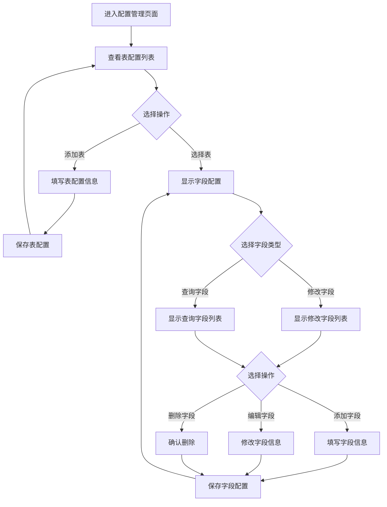
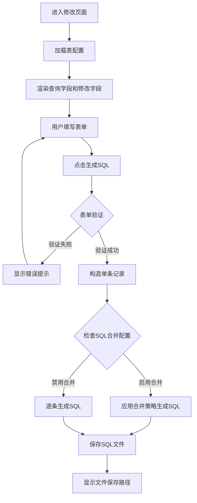
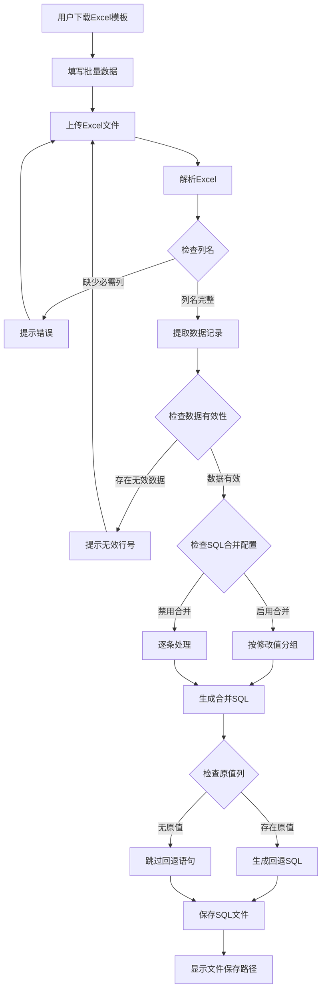

# 可配置通用数据修改页面设计

## 一、功能概述

新增一个灵活的通用数据修改页面，允许通过配置管理界面动态定义表名、可修改字段、查询条件字段，支持单条修改和批量导入两种操作模式，自动生成符合项目规范的 SQL 脚本。

### 核心价值

- 降低新增简单数据修改功能的开发成本
- 避免为每个简单表修改需求单独开发页面
- 通过可视化配置管理表和字段元数据
- 统一 SQL 生成规范和合并策略

## 二、业务场景

### 场景示例

**示例 1：供应商名称修改**

- 目标表：tphct01
- 可修改字段：SUPPLIER_NAME（供应商名称）、BPO_NAME（合同名称）、UNIT_BPO_ID（本单位合同编号）
- 查询条件：BPO_ID（合同号）、ALIVE_FLAG（有效状态）

**示例 2：需求计划额外属性修改**

- 目标表：tprly02
- 可修改字段：根据实际业务定义
- 查询条件：根据实际业务定义

### 适用范围

- 简单的字段值修改需求（不涉及复杂业务规则）
- 需要支持批量数据修改的场景
- 需要生成 SQL 执行和回退脚本的场景
- 不需要复杂数据校验和关联操作的场景

### 不适用场景

- 涉及多表关联更新的复杂业务逻辑
- 需要实时校验外部系统数据的场景
- 需要复杂计算公式的字段修改
- 需要特殊 UI 交互的功能

## 三、功能设计

### 3.1 配置管理

配置管理入口位于系统配置分组下，与现有的下拉框配置管理平级。

#### 3.1.1 表配置

存储可配置表的元数据信息。

| 配置项   | 说明                    | 必填 | 示例                         |
| -------- | ----------------------- | ---- | ---------------------------- |
| 表编码   | 唯一标识，用于 URL 路由 | 是   | tphct01_supplier             |
| 表名     | 实际数据库表名          | 是   | tphct01                      |
| 显示名称 | 页面标题和导航显示      | 是   | 供应商名称修改               |
| 描述     | 功能说明                | 否   | 修改合同主表的供应商相关信息 |
| 是否启用 | 控制页面是否可访问      | 是   | 默认启用                     |
| 排序顺序 | 在列表中的显示顺序      | 否   | 默认 0                       |

#### 3.1.2 字段配置

定义每个表的可修改字段和查询条件字段。

| 配置项       | 说明                | 必填 | 示例                   |
| ------------ | ------------------- | ---- | ---------------------- |
| 所属表       | 关联表配置          | 是   | tphct01_supplier       |
| 字段类型     | 修改字段 / 查询字段 | 是   | 修改字段               |
| 字段名       | 数据库字段名        | 是   | SUPPLIER_NAME          |
| 显示名称     | 表单标签            | 是   | 供应商名称             |
| 字段数据类型 | 文本 / 数字 / 日期  | 是   | 文本                   |
| 是否必填     | 表单验证规则        | 否   | 否                     |
| 最大长度     | 文本字段长度限制    | 否   | 255                    |
| 默认值       | 查询字段的默认值    | 否   | 1（ALIVE_FLAG 默认值） |
| 排序顺序     | 字段在表单中的顺序  | 否   | 默认 0                 |
| 是否启用     | 控制字段是否显示    | 是   | 默认启用               |

#### 3.1.3 配置管理界面结构

采用左右布局结构，参考下拉框配置管理界面设计。

**左侧区域：表配置列表**

- 显示所有已配置的表
- 支持添加、编辑、启用/禁用表配置
- 点击表配置项切换右侧字段配置显示

**右侧区域：字段配置管理**

- 分为两个标签页：修改字段配置、查询字段配置
- 每个标签页显示对应类型的字段列表
- 支持添加、编辑、删除、启用/禁用字段
- 支持拖拽调整字段排序顺序

### 3.2 数据修改页面

根据配置动态生成的数据修改操作页面。

#### 3.2.1 页面布局

采用与现有功能页面一致的布局风格。

**基本信息区**

- 编号输入框（用于 SQL 文件命名）
- 操作备注输入框（支持 ONES 链接格式）

**查询条件区**

- 根据表配置的查询字段动态生成输入框
- 必填字段标记红色星号
- 有默认值的字段自动填充

**修改数据区**

- 根据表配置的修改字段动态生成输入框
- 必填字段标记红色星号
- 支持空值（用于清空字段）

**批量导入区**

- Excel 文件上传控件
- 模板下载链接
- 文件格式说明

**操作按钮区**

- 生成 SQL 按钮（主操作）
- 清除按钮（清空表单）

#### 3.2.2 表单验证规则

**单条修改模式**

- 所有查询字段必填
- 至少填写一个修改字段
- 数字字段验证数值格式
- 文本字段验证最大长度

**批量导入模式**

- 必须上传 Excel 文件
- Excel 必须包含所有查询字段列
- Excel 必须包含至少一个修改字段列
- 列名匹配忽略大小写

#### 3.2.3 Excel 模板生成

根据表配置动态生成 Excel 模板。

**模板结构**

- 第一行：字段显示名称（中文）
- 第二行：字段数据库名称（用于列映射）
- 第三行：示例数据行

**列顺序**

- 查询字段列在前
- 修改字段列在后
- 原值列（用于回退 SQL）在最后

### 3.3 SQL 生成规则

#### 3.3.1 执行 SQL 生成

遵循项目现有的 SQL 合并策略。

**合并策略启用时**

- 按修改字段值分组
- 相同修改值的记录合并为 IN 查询
- IN 查询的 ID 数量上限为 500（从配置读取 MERGE_MAX_IN_SIZE）

**合并策略禁用时**

- 逐条生成 UPDATE 语句

**SQL 模板**

```
UPDATE {表名} SET
  {字段1}={值1},
  {字段2}={值2},
  OPS_REMARK='{操作备注}'
WHERE {查询字段1}='{值1}' AND {查询字段2}='{值2}'
```

#### 3.3.2 回退 SQL 生成

仅当 Excel 包含原值列时生成回退语句。

**原值列命名规则**

- 在字段数据库名前加"orig\_"前缀
- 例如：SUPPLIER_NAME 的原值列为 orig_SUPPLIER_NAME

**回退 SQL 模板**

```
UPDATE {表名} SET
  {字段1}={原值1},
  {字段2}={原值2},
  OPS_REMARK=''
WHERE {查询字段1}='{值1}' AND {查询字段2}='{值2}'
```

#### 3.3.3 SQL 脚本输出格式

遵循项目 SQL 脚本输出规范。

```
1、执行语句
UPDATE ...
UPDATE ...

2、回退语句
UPDATE ...
UPDATE ...

3.数据库
ip：192.168.11.71
库名：cnnc_ph
```

### 3.4 导航集成

在导航系统中添加特殊模板分组。

**导航位置**

- 新增"特殊模板"分组，图标使用'bi-tools'
- 位于系统配置分组之后
- 仅显示已启用的表配置项

**动态菜单生成**

- 页面加载时查询启用的表配置
- 每个表配置生成一个菜单项
- 菜单项标签使用表的显示名称
- URL 路由使用表编码

## 四、数据模型设计

### 4.1 表配置模型（ConfigurableTable）

| 字段名       | 类型        | 说明             |
| ------------ | ----------- | ---------------- |
| id           | 自增主键    | 记录唯一标识     |
| table_code   | 字符串(50)  | 表编码，唯一索引 |
| table_name   | 字符串(100) | 数据库表名       |
| display_name | 字符串(200) | 显示名称         |
| description  | 文本        | 功能描述         |
| is_active    | 布尔        | 是否启用         |
| sort_order   | 整数        | 排序顺序         |
| created_at   | 日期时间    | 创建时间         |
| updated_at   | 日期时间    | 更新时间         |

### 4.2 字段配置模型（ConfigurableField）

| 字段名        | 类型        | 说明                       |
| ------------- | ----------- | -------------------------- |
| id            | 自增主键    | 记录唯一标识               |
| table         | 外键        | 关联 ConfigurableTable     |
| field_type    | 字符串(20)  | 字段类型：update/query     |
| field_name    | 字符串(100) | 数据库字段名               |
| display_name  | 字符串(200) | 显示名称                   |
| data_type     | 字符串(20)  | 数据类型：text/number/date |
| is_required   | 布尔        | 是否必填                   |
| max_length    | 整数        | 最大长度（可选）           |
| default_value | 字符串(255) | 默认值（可选）             |
| sort_order    | 整数        | 排序顺序                   |
| is_active     | 布尔        | 是否启用                   |
| created_at    | 日期时间    | 创建时间                   |
| updated_at    | 日期时间    | 更新时间                   |

**索引设计**

- table + field_type + is_active 组合索引（查询性能优化）
- table + field_name 唯一索引（保证同表字段名唯一）

## 五、交互流程设计

### 5.1 配置管理流程



### 5.2 单条修改流程



### 5.3 批量导入流程



## 六、技术实现要点

### 6.1 模块结构

**数据模型**

- work_tools/models.py：新增 ConfigurableTable 和 ConfigurableField 模型

**配置管理视图**

- work_tools/views/configurable_config.py：表和字段配置管理视图

**数据修改视图**

- work_tools/views/configurable_data.py：动态数据修改视图和 SQL 生成

**表单定义**

- work_tools/forms.py：配置管理表单和动态数据修改表单

**模板文件**

- work_tools/templates/configurable_config.html：配置管理界面
- work_tools/templates/configurable_data.html：数据修改界面

**URL 路由**

- work_tools/urls.py：新增配置管理和数据修改路由

**导航配置**

- work_tools/navigation.py：新增特殊模板分组和动态菜单

### 6.2 动态表单生成

根据字段配置动态构造 Django 表单字段。

**字段类型映射**

- text → forms.CharField
- number → forms.DecimalField
- date → forms.DateField

**表单字段属性**

- required 属性根据 is_required 配置
- max_length 属性根据 max_length 配置
- initial 属性根据 default_value 配置
- label 属性使用 display_name 配置

### 6.3 Excel 解析策略

支持灵活的列名匹配规则。

**列名匹配规则**

- 优先匹配字段数据库名（忽略大小写）
- 其次匹配字段显示名称
- 如果第二行包含字段名，使用第二行进行映射

**数据提取**

- 跳过标题行和字段名行
- 从第三行开始提取数据
- 忽略空行
- 验证必填列不为空

### 6.4 SQL 合并策略集成

复用现有的 sql_merge 模块工具函数。

**使用的工具函数**

- chunk_list：将 ID 列表分块
- format_in：格式化 IN 子句
- merge_by_key：按键分组记录
- to_literal：值转 SQL 字面量

**配置读取**

- 从 app_config.json 读取 MERGE_MAX_IN_SIZE
- 从 app_config.json 读取 MERGE_MODULES 配置
- 为每个表编码添加独立的合并策略开关

### 6.5 日志记录

遵循项目日志规范，记录关键操作。

**配置管理日志**

- 表配置的添加、编辑、删除
- 字段配置的添加、编辑、删除
- 启用/禁用操作

**数据修改日志**

- 用户输入参数记录
- Excel 解析结果统计
- SQL 合并策略应用情况
- SQL 文件生成路径

### 6.6 数据库迁移

创建迁移文件初始化配置表结构。

**迁移操作**

- 创建 ConfigurableTable 表
- 创建 ConfigurableField 表
- 创建必要的索引
- 预置示例配置数据（可选）

### 6.7 配置缓存

优化配置加载性能，减少数据库查询。

**缓存策略**

- 表配置列表缓存 30 分钟
- 字段配置列表缓存 30 分钟
- 配置修改时自动清除缓存

**缓存键命名**

- configurable_tables：所有启用的表配置
- configurable*fields*{table_code}：指定表的字段配置

## 七、配置示例

### 示例 1：供应商名称修改

**表配置**

- 表编码：tphct01_supplier
- 表名：tphct01
- 显示名称：供应商名称修改
- 描述：修改合同主表的供应商相关信息

**查询字段配置**

| 字段名     | 显示名称 | 数据类型 | 必填 | 默认值 |
| ---------- | -------- | -------- | ---- | ------ |
| BPO_ID     | 合同号   | 文本     | 是   | -      |
| ALIVE_FLAG | 有效状态 | 文本     | 是   | 1      |

**修改字段配置**

| 字段名        | 显示名称       | 数据类型 | 必填 | 最大长度 |
| ------------- | -------------- | -------- | ---- | -------- |
| SUPPLIER_NAME | 供应商名称     | 文本     | 否   | 255      |
| BPO_NAME      | 合同名称       | 文本     | 否   | 500      |
| UNIT_BPO_ID   | 本单位合同编号 | 文本     | 否   | 100      |

### 示例 2：需求计划备注修改

**表配置**

- 表编码：tprly02_remark
- 表名：tprly02
- 显示名称：需求计划备注修改
- 描述：修改需求计划明细的备注信息

**查询字段配置**

| 字段名       | 显示名称  | 数据类型 | 必填 | 默认值 |
| ------------ | --------- | -------- | ---- | ------ |
| PLAN_LINE_ID | 计划行 ID | 文本     | 是   | -      |
| ALIVE_FLAG   | 有效状态  | 文本     | 是   | 1      |

**修改字段配置**

| 字段名 | 显示名称 | 数据类型 | 必填 | 最大长度 |
| ------ | -------- | -------- | ---- | -------- |
| REMARK | 备注     | 文本     | 否   | 2000     |

## 八、非功能性设计

### 8.1 性能要求

- 配置管理页面加载时间 < 1 秒
- 单条修改 SQL 生成时间 < 0.5 秒
- 批量导入 1000 条记录 SQL 生成时间 < 3 秒
- Excel 模板下载响应时间 < 0.5 秒

### 8.2 安全性要求

- 配置管理操作需要管理员权限（如已有权限控制机制）
- SQL 注入防护：所有用户输入经过 to_literal 函数转义
- 文件上传限制：仅允许.xlsx 和.xls 格式
- 文件大小限制：单个 Excel 文件不超过 10MB

### 8.3 可维护性要求

- 配置管理界面提供配置导出功能（可选）
- 字段配置支持批量导入（可选）
- 日志详细记录配置变更历史
- 代码注释清晰说明配置加载和 SQL 生成逻辑

### 8.4 兼容性要求

- 复用现有的 SQL 合并策略配置
- 遵循现有的 SQL 文件命名规范
- 复用现有的 SQL 文件保存路径配置
- 样式风格与现有页面保持一致

## 九、验收标准

### 9.1 配置管理功能

- 可以添加、编辑、删除表配置
- 可以添加、编辑、删除字段配置
- 可以启用/禁用表配置和字段配置
- 配置修改后立即生效
- 配置列表正确显示排序

### 9.2 数据修改功能

- 单条修改模式：填写查询条件和修改字段后生成正确 SQL
- 批量导入模式：上传 Excel 后生成批量 SQL
- SQL 合并策略正确应用
- 生成的 SQL 文件保存到配置的固定目录
- 文件命名格式：{编号}\_{表显示名称}.sql

### 9.3 Excel 模板功能

- 点击模板下载链接下载 Excel 文件
- 模板包含正确的列标题
- 模板包含字段名称行
- 模板包含示例数据行

### 9.4 SQL 脚本质量

- SQL 语法正确无误
- 包含执行语句和回退语句两个部分
- 包含数据库连接信息
- 启用合并策略时正确生成 IN 查询
- 禁用合并策略时逐条生成 UPDATE 语句

### 9.5 导航集成

- 导航菜单中显示"特殊模板"分组
- 分组下显示所有已启用的表配置
- 点击菜单项跳转到对应的数据修改页面
- 禁用的表配置不显示在导航中

## 十、后续扩展方向

### 10.1 短期扩展

- 支持字段值的下拉选择（关联下拉框配置）
- 支持字段间的依赖关系（字段 A 选择后影响字段 B）
- 支持更多数据类型（布尔值、时间戳等）
- 配置导出和导入功能

### 10.2 长期扩展

- 支持多表联合更新
- 支持自定义 SQL 模板
- 支持复杂查询条件（OR、IN、LIKE 等）
- 支持数据预览和 SQL 预览
- 支持配置版本管理和回滚
