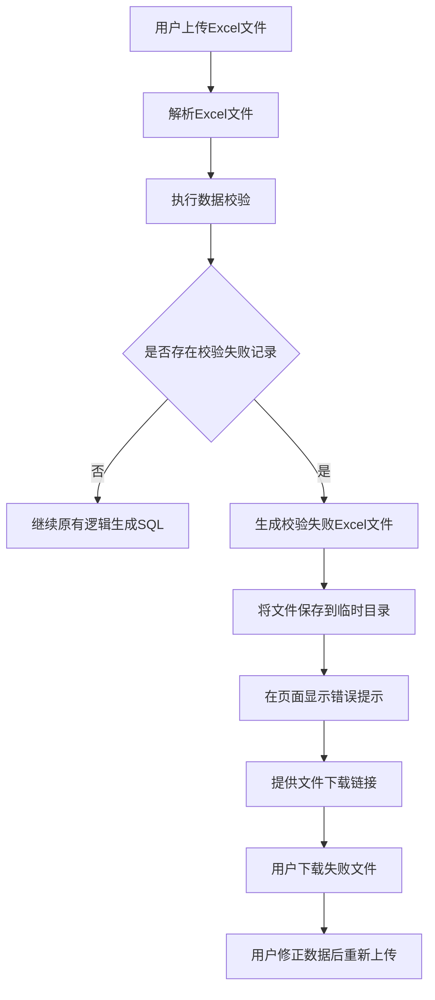
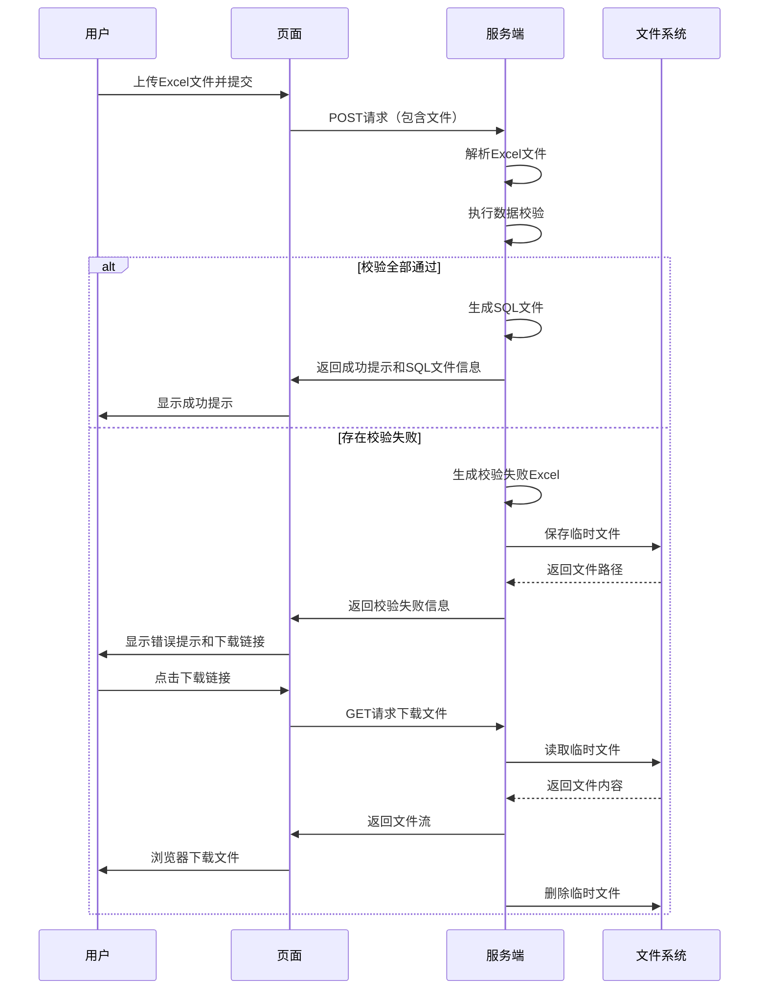

# 批量导入校验失败文件下载功能设计

## 一、功能背景

### 当前状况
系统中所有生成页面均提供批量导入功能，用户可以通过上传Excel文件来批量提交数据。各功能模块包括：
- 物资编码修改（contract_item）
- 合同预算修改（contract_budget）
- 物项重要性修改（importance）
- 适用清单修改（use_list）
- 合同失效日期修改（end_date）
- 浮动价格类型修改（price_type）
- 合同状态修改（appr_state）
- 合同终止（contract_terminate）
- ERP终止（erp_terminate）
- 政府报送修改（gov_report）
- 采购轮次修改（project_round）

### 存在问题
当前批量导入功能缺少对必填项和数据有效性的校验，导致：
- 用户上传的文件中如果存在必填项缺失，无法及时发现
- 数据格式或取值范围不符合要求时，无反馈机制
- 校验失败后，用户无法获得包含错误信息的文件，难以快速定位和修正问题
- 用户需要手动对照错误信息逐行检查原始文件，效率低下

### 功能目标
为批量导入功能补充数据校验能力，并在校验失败时提供包含错误信息的Excel文件下载功能，帮助用户快速定位和修正数据问题。

## 二、功能范围

### 涉及模块
本次功能涵盖所有包含Excel批量导入的功能模块，具体包括：
- 物资编码修改（contract_item_update_view）
- 合同预算修改（contract_budget_update_view）
- 物项重要性修改（importance_update_view）
- 适用清单修改（use_list_update_view）
- 合同失效日期修改（end_date_update_view）
- 浮动价格类型修改（floating_price_type_view）
- 合同状态修改（appr_state_change_view）
- 合同终止（contract_terminate_view）
- ERP终止（erp_terminate_view）
- 政府报送修改（gov_report_view）
- 采购轮次修改（project_round_view）

### 核心能力
1. 必填项校验：检查必填字段是否为空
2. 数据有效性校验：检查数据格式、取值范围、引用完整性
3. 校验失败文件生成：在原始Excel基础上添加错误信息列
4. 文件下载：提供校验失败文件的下载功能

## 三、校验规则设计

### 通用校验规则

#### 必填项校验规则
对所有批量导入模块应用统一的必填项校验逻辑：

| 模块 | 必填字段 | 校验规则 |
|------|---------|---------|
| 物资编码修改 | 明细行ID | 不能为空或空白字符 |
| 合同预算修改 | 新预算，且标段编号或合同号至少填一个 | 数值类型不能为空，标段编号或合同号至少存在一个 |
| 物项重要性修改 | 物项重要性，且采购方案编号/询价单编号/合同号至少填一个 | 重要性不能为空，业务单据编号至少存在一个 |
| 适用清单修改 | BUSINESS_ID, 新组织机构名称 | 字符串不能为空或仅包含空白字符 |
| 失效日期修改 | 合同编号, 新失效日期 | 不能为空，日期格式需符合YYYYMMDD |
| 浮动价格类型修改 | 合同编号, 浮动价格类型 | 不能为空 |
| 合同状态修改 | 合同ID, 新合同状态 | 不能为空 |
| 合同终止 | 合同ID | 不能为空 |
| ERP终止 | 询价单ID/采购方案编号/采购包编号至少填一个 | 业务单据编号至少存在一个 |
| 政府报送修改 | 采购方案编号/询价单编号/合同编号至少填一个, 是否报送 | 业务单据编号至少存在一个，是否报送不能为空 |
| 采购轮次修改 | 采购方案编号 | 不能为空 |

#### 数据有效性校验规则

| 校验类型 | 适用模块 | 校验规则 | 错误提示 |
|---------|---------|---------|---------|
| 日期格式 | 失效日期修改 | 必须符合YYYYMMDD格式，且为有效日期 | "日期格式错误，应为YYYYMMDD格式" |
| 枚举值 | 物项重要性修改 | 必须为预定义的重要性级别之一（一般准入备案类/一般自行管理类/一般/核心/重要/0/1/2/3/4） | "重要性取值无效，应为：一般准入备案类/一般自行管理类/一般/核心/重要" |
| 枚举值 | 政府报送修改 | 必须为"是"或"否" | "是否报送取值无效，应为：是/否" |
| 枚举值 | 合同状态修改 | 必须为预定义的合同状态之一 | "合同状态取值无效" |
| 枚举值 | 浮动价格类型修改 | 必须为预定义的价格类型之一 | "价格类型取值无效" |
| 数值格式 | 合同预算修改 | 必须为有效数值 | "预算必须为数值" |
| 物资引用 | 物资编码修改 | 如果填写了物资编码，应在物资主数据（ItemDetail）中存在（可选校验） | "物资编码不存在" |
| 组织引用 | 适用清单修改 | 如果填写了组织编码，应在组织主数据（OrgDetail）中存在（可选校验） | "组织编码不存在" |

### 校验执行时机
在各视图函数的POST请求处理中，Excel文件解析完成后、SQL生成之前执行校验逻辑。

## 四、校验失败处理流程

### 整体流程



### 校验失败文件生成规则

#### 文件结构
在原始Excel文件的基础上：
- 保留所有原始列
- 在最后增加一列"校验结果"
- 校验通过的行，该列为空或显示"通过"
- 校验失败的行，该列显示具体错误信息
- 如果一行存在多个错误，错误信息用分号分隔

#### 错误信息格式
错误信息应清晰明确，便于用户快速理解和修正，格式示例：
- "明细行ID不能为空"
- "新预算必须为数值"
- "日期格式错误，应为YYYYMMDD格式"
- "重要性取值无效，应为：一般准入备案类/一般自行管理类/一般/核心/重要"
- "必须填写标段编号或合同号至少一个"

#### 文件命名规则
格式：`validation_failed_{模块名称}_{时间戳}.xlsx`
示例：
- `validation_failed_contract_item_20250106_153045.xlsx`
- `validation_failed_importance_20250106_153128.xlsx`

### 临时文件管理

#### 存储位置
使用Django的临时目录机制，将校验失败文件存储在：
- 路径：`{BASE_DIR}/temp_uploads/validation_failures/`
- 自动创建目录（如不存在）

#### 文件清理策略
- 用户下载后立即删除文件（可选）
- 定期清理超过24小时的临时文件（通过定时任务或中间件）

## 五、前端交互设计

### 页面展示变更

#### 校验失败提示区域
在表单上方增加错误提示区域，当存在校验失败时显示：

提示内容结构：
- 错误类型：警告（使用alert-warning或alert-danger样式）
- 标题：数据校验失败
- 详细信息：
  - 总行数：{total}
  - 失败行数：{failed_count}
  - 通过行数：{passed_count}
- 下载链接：点击下载包含错误信息的文件

提示样式：
- 背景色：浅红色或浅黄色
- 边框：红色或橙色
- 图标：警告图标
- 下载按钮：醒目的按钮样式

#### 下载链接实现
- 提供独立的下载URL路径：`/download_validation_failure/?file={临时文件名}`
- 下载完成后自动清理临时文件
- 文件不存在时返回404错误

### 用户操作流程



## 六、技术实现方案

### 代码结构设计

#### 新增通用校验模块
创建独立的校验工具模块：`work_tools/validation_utils.py`

模块职责：
- 提供通用的字段校验函数（必填项、数值、日期、枚举等）
- 提供校验结果收集和错误信息格式化功能
- 提供校验失败Excel生成功能
- 提供临时文件管理功能

核心函数设计：

| 函数名 | 功能 | 输入参数 | 返回值 |
|--------|------|---------|--------|
| validate_required | 必填项校验 | 值, 字段名称 | 错误信息或None |
| validate_number | 数值校验 | 值, 字段名称 | 错误信息或None |
| validate_date_format | 日期格式校验 | 值, 字段名称, 日期格式 | 错误信息或None |
| validate_enum | 枚举值校验 | 值, 字段名称, 可选值列表 | 错误信息或None |
| validate_reference | 引用完整性校验 | 值, 字段名称, 模型类, 查询字段 | 错误信息或None |
| generate_validation_failure_excel | 生成校验失败文件 | 原始工作簿, 校验结果列表 | 文件路径 |
| save_validation_temp_file | 保存临时文件 | 工作簿对象, 模块名称 | 文件路径 |
| cleanup_temp_files | 清理过期临时文件 | 过期时间（小时） | 清理文件数量 |

#### 各模块校验函数设计
为每个导入模块创建专门的校验函数，函数命名规范：`validate_{module_name}_records`

函数职责：
- 接收解析后的记录列表
- 对每条记录执行特定的校验规则
- 返回校验结果（包含每行的校验状态和错误信息）

函数返回结构：
```python
{
    'valid': True/False,  # 整体是否通过校验
    'total': 100,  # 总行数
    'passed': 95,  # 通过行数
    'failed': 5,  # 失败行数
    'results': [  # 每行的校验结果
        {
            'row_number': 2,  # 行号（从2开始，因为第1行是表头）
            'valid': True,  # 该行是否通过
            'errors': []  # 错误信息列表
        },
        {
            'row_number': 3,
            'valid': False,
            'errors': ['明细行ID不能为空', '新物资编码不能为空']
        },
        ...
    ]
}
```

### 视图函数改造方案

#### 改造步骤
对每个包含Excel批量导入的视图函数进行改造：

1. 在Excel解析函数之后，增加校验函数调用
2. 根据校验结果判断是否继续生成SQL
3. 校验失败时生成校验失败文件并保存
4. 在模板渲染时传递校验失败信息
5. 提供校验失败文件下载路由

#### 改造代码位置
各模块的视图函数文件：
- `work_tools/views/contract_item.py` - contract_item_update_view函数
- `work_tools/views/contract_budget.py` - contract_budget_update_view函数
- `work_tools/views/importance.py` - importance_update_view函数
- `work_tools/views/use_list.py` - use_list_update_view函数
- `work_tools/views/enddate.py` - end_date_update_view函数
- `work_tools/views/price_type.py` - floating_price_type_view函数
- `work_tools/views/appr_state.py` - appr_state_change_view函数
- `work_tools/views/contract_terminate.py` - contract_terminate_view函数
- `work_tools/views/erp_terminate.py` - erp_terminate_view函数
- `work_tools/views/gov_report.py` - gov_report_view函数
- `work_tools/views/project_round.py` - project_round_view函数

#### 视图函数改造逻辑结构
在POST请求处理中：
```
1. 表单验证通过
2. 解析Excel文件 → 获得records列表
3. 执行数据校验 → 获得validation_result
4. 判断validation_result['valid']
   - 如果为True：继续原有逻辑（生成SQL）
   - 如果为False：
     a. 重新打开Excel文件
     b. 调用generate_validation_failure_excel生成失败文件
     c. 保存临时文件
     d. 在上下文中传递validation_failure信息
     e. 渲染模板（显示错误提示）
     f. 不生成SQL文件
```

### 下载路由设计

#### URL路由定义
在`work_tools/urls.py`中增加统一的下载路由：
- 路径：`download_validation_failure/`
- 视图函数：`download_validation_failure_view`
- 请求方式：GET
- 参数：`file` - 临时文件名

#### 下载视图函数
在`work_tools/views/base.py`中实现通用下载函数

函数职责：
- 接收文件名参数
- 验证文件名合法性（防止路径遍历攻击）
- 检查文件是否存在
- 返回文件流
- 下载后删除临时文件

安全性考虑：
- 仅允许下载validation_failures目录下的文件
- 验证文件名格式（仅允许特定前缀和后缀）
- 限制下载频率（可选）

### 模板改造方案

#### 所有批量导入表单模板需要增加的内容

1. 错误提示区域（在表单上方）
   - 使用条件判断：当validation_failure存在时显示
   - 显示总行数、失败行数、通过行数
   - 提供下载链接

2. 下载链接生成
   - 使用Django的url标签生成下载URL
   - 传递临时文件名作为参数

#### 需要改造的模板文件
- `work_tools/templates/contract_item_form.html`
- `work_tools/templates/contract_budget_form.html`
- `work_tools/templates/importance_form.html`
- `work_tools/templates/use_list_update_form.html`
- `work_tools/templates/end_date_form.html`
- `work_tools/templates/floating_price_type_form.html`
- `work_tools/templates/appr_state_change.html`
- `work_tools/templates/contract_terminate.html`
- `work_tools/templates/erp_terminate_form.html`
- `work_tools/templates/gov_report_form.html`
- `work_tools/templates/project_round.html`

#### 模板改造结构示例
在表单区域上方增加：
```
条件判断：如果validation_failure存在
  显示警告提示框
    标题：数据校验失败
    内容：
      - 总行数：{total}
      - 失败行数：{failed}
      - 通过行数：{passed}
    下载按钮：
      - 文本：下载包含错误信息的文件
      - 链接：download_validation_failure/?file={filename}
      - 样式：btn btn-warning
```

## 七、数据库设计

### 是否需要新增表
不需要新增数据库表。

理由：
- 校验失败文件为临时性文件，不需要持久化存储
- 校验结果仅在当前请求中使用
- 使用文件系统存储临时文件即可

### 可选的优化方案（后期扩展）
如果需要追踪校验历史，可以考虑新增表：

| 表名 | 字段 | 说明 |
|------|------|------|
| validation_log | id, module_name, upload_time, total_rows, failed_rows, passed_rows, file_path, user_id | 记录每次校验的统计信息 |

但当前阶段不建议实现，保持简单。

## 八、异常处理设计

### 异常场景识别

| 异常场景 | 处理策略 |
|---------|---------|
| Excel文件格式错误 | 在解析阶段捕获，返回友好错误提示"文件格式错误，请确保上传.xlsx格式文件" |
| Excel文件为空或无数据行 | 校验阶段返回"文件中没有有效的数据行" |
| 临时目录创建失败 | 捕获异常，记录日志，返回"系统错误，无法保存文件" |
| 临时文件写入失败 | 捕获异常，记录日志，返回"系统错误，无法生成校验失败文件" |
| 下载文件不存在 | 返回404错误，提示"文件不存在或已过期" |
| 下载文件读取失败 | 捕获异常，记录日志，返回500错误 |
| 校验函数执行异常 | 捕获异常，记录详细日志，返回"数据校验失败，请联系管理员" |

### 错误日志记录
所有异常应记录到系统日志，包含：
- 时间戳
- 模块名称
- 异常类型
- 异常详细信息
- 用户信息（如果可用）
- 文件信息（如果可用）

### 用户错误提示原则
- 清晰明确，指出问题所在
- 提供解决建议
- 避免暴露系统内部信息
- 使用统一的错误提示样式

## 九、性能考虑

### 大文件处理策略

#### 文件大小限制
- 建议限制：单个Excel文件不超过10MB
- 行数限制：建议不超过10000行
- 在表单验证中增加文件大小检查
- 超过限制时给出友好提示

#### 分批处理机制（可选扩展）
如果未来需要支持更大文件：
- 将记录分批进行校验（如每1000行一批）
- 校验过程中显示进度条
- 使用异步任务处理（如Celery）

### 内存优化
- 使用openpyxl的read_only模式读取Excel（仅读取，不修改原文件）
- 生成校验失败文件时，使用流式写入
- 及时释放不再使用的对象

### 校验性能优化
- 数据库查询批量化（如物资编码校验，使用IN查询而非逐条查询）
- 缓存查询结果（如枚举值列表）
- 避免重复查询

## 十、测试策略

### 测试用例设计

#### 单元测试
针对validation_utils.py中的各个校验函数：

| 测试函数 | 测试场景 | 预期结果 |
|---------|---------|---------|
| test_validate_required_with_empty | 必填项为空 | 返回错误信息 |
| test_validate_required_with_value | 必填项有值 | 返回None |
| test_validate_number_with_invalid | 非数值字符串 | 返回错误信息 |
| test_validate_number_with_valid | 有效数值 | 返回None |
| test_validate_date_format_valid | 正确日期格式 | 返回None |
| test_validate_date_format_invalid | 错误日期格式 | 返回错误信息 |
| test_validate_enum_valid | 在枚举值范围内 | 返回None |
| test_validate_enum_invalid | 不在枚举值范围内 | 返回错误信息 |
| test_generate_validation_failure_excel | 生成校验失败文件 | 返回有效文件路径，文件包含校验结果列 |

#### 集成测试
针对各个模块的校验函数：

| 模块 | 测试场景 | 预期结果 |
|------|---------|---------|
| 物资编码修改 | 上传缺少明细行ID的文件 | 返回校验失败，生成包含错误信息的文件 |
| 合同预算修改 | 上传预算字段为非数值的文件 | 返回校验失败，错误信息为"预算必须为数值" |
| 物项重要性修改 | 上传重要性取值无效的文件 | 返回校验失败，错误信息提示有效取值 |
| 所有模块 | 上传全部数据有效的文件 | 校验通过，正常生成SQL |

#### 功能测试
端到端测试：

| 测试步骤 | 操作 | 预期结果 |
|---------|------|---------|
| 1 | 访问物资编码修改页面 | 页面正常显示 |
| 2 | 上传包含错误数据的Excel文件 | 提示校验失败，显示失败行数 |
| 3 | 点击下载链接 | 成功下载Excel文件 |
| 4 | 打开下载的文件 | 文件包含"校验结果"列，错误行显示具体错误信息 |
| 5 | 修正数据后重新上传 | 校验通过，生成SQL文件 |

### 边界条件测试

| 场景 | 预期行为 |
|------|---------|
| 上传空Excel文件 | 提示"文件中没有有效的数据行" |
| 上传仅有表头无数据行的文件 | 提示"文件中没有有效的数据行" |
| 上传超大文件（超过限制） | 提示"文件过大，请分批上传" |
| 上传包含10000条数据的文件 | 校验正常完成，性能可接受 |
| 下载不存在的文件 | 返回404错误 |
| 同时上传多个文件（并发） | 各请求独立处理，互不干扰 |

## 十一、实施计划

### 开发优先级

#### 第一阶段：核心功能（必须）
1. 创建validation_utils.py工具模块
2. 实现基础校验函数（必填项、数值、日期、枚举）
3. 实现校验失败文件生成函数
4. 改造1-2个代表性模块（如物资编码修改、物项重要性修改）
5. 实现下载路由和视图
6. 改造对应的模板
7. 编写基础测试用例

#### 第二阶段：全面覆盖（重要）
1. 为所有批量导入模块实现校验函数
2. 改造所有相关视图函数
3. 改造所有相关模板
4. 补充完整的测试用例
5. 性能测试和优化

#### 第三阶段：增强功能（可选）
1. 增加引用完整性校验（物资、组织）
2. 实现临时文件自动清理
3. 增加文件大小和行数限制
4. 优化大文件处理性能
5. 增加校验日志记录

### 开发工作量估算

| 任务 | 预估工时（小时） |
|------|----------------|
| validation_utils.py开发 | 8 |
| 单个模块校验函数开发 | 2 |
| 11个模块校验函数开发 | 22 |
| 单个视图函数改造 | 1.5 |
| 11个视图函数改造 | 16.5 |
| 单个模板改造 | 0.5 |
| 11个模板改造 | 5.5 |
| 下载路由和视图开发 | 3 |
| 单元测试编写 | 8 |
| 集成测试编写 | 8 |
| 功能测试和调试 | 8 |
| 文档编写 | 4 |
| **总计** | **约83小时** |

### 风险控制

| 风险 | 影响 | 应对措施 |
|------|------|---------|
| openpyxl库性能瓶颈 | 大文件处理慢 | 增加文件大小限制，优化读写方式 |
| 校验规则遗漏 | 无效数据通过校验 | 仔细梳理业务规则，编写完整测试用例 |
| 临时文件堆积 | 磁盘空间不足 | 实现自动清理机制，设置文件过期时间 |
| 多模块改造引入Bug | 影响现有功能 | 充分测试，分模块逐步上线 |
| 用户体验不佳 | 用户不知如何修正数据 | 优化错误提示，提供清晰的修正指引 |

## 十二、后期优化方向

### 功能增强
1. 支持多语言错误提示
2. 提供校验规则配置界面（动态配置校验规则）
3. 增加校验历史记录查询功能
4. 支持批量修正建议（如自动填充默认值）
5. 提供在线预览功能（显示前10行校验结果）

### 性能优化
1. 引入缓存机制（Redis）缓存枚举值、常用查询结果
2. 使用异步任务处理大文件
3. 实现进度条显示校验进度
4. 数据库查询优化（添加索引、批量查询）

### 用户体验优化
1. 提供Excel模板中的数据验证功能（下拉列表、数据格式限制）
2. 在线填写模式（类似Excel的在线编辑，实时校验）
3. 智能推荐（如物资编码输入时提示匹配项）
4. 批量修正工具（快速修正常见错误）
