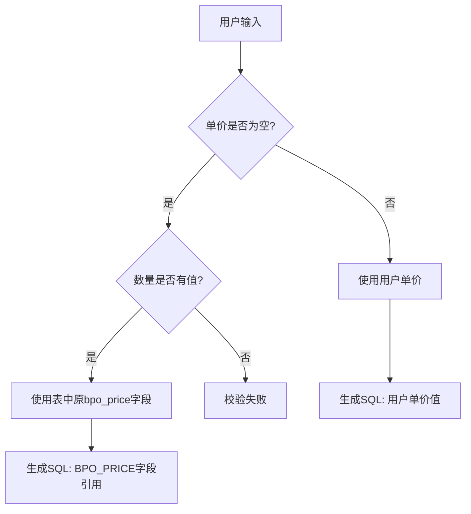
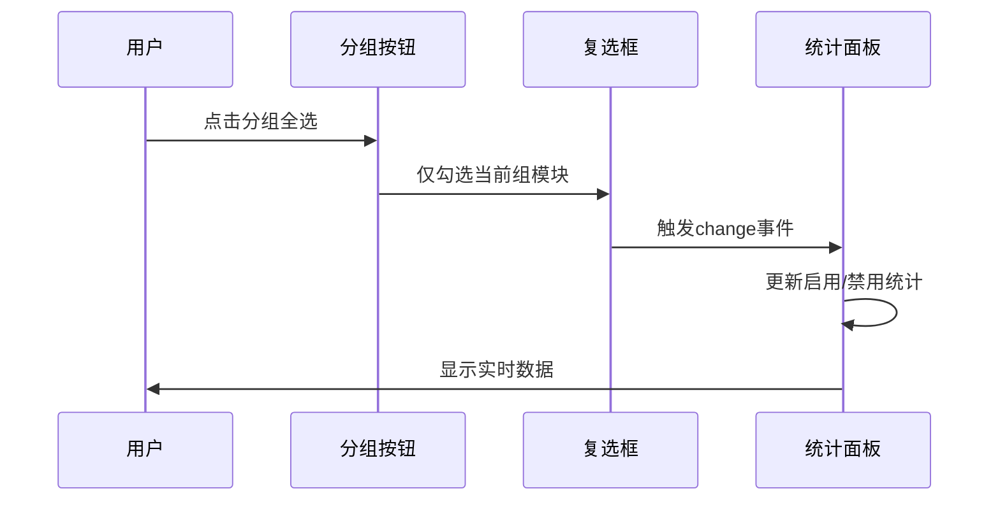

# Bug 修复设计文档

## 问题概述

本次修复针对项目尾声阶段发现的三个关键缺陷，涉及数据处理逻辑、UI 交互体验和配置管理完整性。

---

## Bug 1: 合同明细单价修改数据处理缺陷

### 问题描述

在合同明细单价修改功能中，当用户填写了数量但未填写单价时，系统 SQL 生成逻辑错误地使用 None 值，导致生成的 SQL 语句无法正确执行。

### 根本原因

SQL 生成逻辑未正确处理"仅修改数量、单价保持原值"的场景，缺少对原始单价字段 bpo_price 的引用逻辑。

### 预期行为

| 场景          | 用户输入          | 系统行为                        |
| ------------- | ----------------- | ------------------------------- |
| 修改数量+单价 | 数量=10, 单价=100 | 使用用户提供的新单价            |
| 仅修改数量    | 数量=10, 单价=空  | 使用表中原有的 bpo_price 字段值 |
| 仅修改单价    | 数量=空, 单价=100 | 使用表中原有的 BPO_QTY 字段值   |

### 修复方案

**影响范围**

- 视图模块：contract_price.py
- 影响函数：generate_price_sql_bulk
- SQL 生成逻辑：执行语句和回退语句

**修复策略**

针对执行语句生成部分（第 89-154 行）：

1. 增加单价为空的判断分支
2. 当单价为空但数量有值时，SQL 使用字段引用：`BPO_PRICE`（原表字段）
3. 当数量为空但单价有值时，SQL 使用字段引用：`BPO_QTY`（原表字段）
4. 确保 SQL 合并策略逻辑同样适用于上述场景

**数据流示意**



**核心修复点**

需要在以下逻辑分支中补充处理：

- 启用 SQL 合并策略分支（第 89-127 行）
- 未启用 SQL 合并策略分支（第 128-154 行）

补充的判断条件：

- 若单价为空且数量有值：BPO_PRICE 引用原表字段
- 若数量为空且单价有值：BPO_QTY 引用原表字段

---

## Bug 2: 合同创建人修改页面侧边栏折叠问题

### 问题描述

进入合同创建人修改页面时，侧边栏自动折叠，导致用户体验不一致。

### 根本原因

contract_creator_form.html 模板中硬编码了`margin-left: 250px`，但未包含侧边栏展开状态控制逻辑，导致页面渲染时侧边栏状态异常。

### 影响模块

- 模板文件：contract_creator_form.html
- 具体位置：第 13 行 body 样式定义

### 修复方案

**方案选择**

移除硬编码的`margin-left: 250px`样式，让页面自适应侧边栏状态。

**修复依据**

参考其他正常页面（如 contract_price_form.html），这些页面未设置固定 margin-left，侧边栏状态由 sidebar.html 组件自行管理。

**修复位置**

```
文件：templates/contract_creator_form.html
行号：第13行
当前样式：margin-left: 250px;
修复操作：删除此样式声明
```

---

## Bug 3: SQL 合并策略配置管理缺陷

### 问题描述

SQL 合并策略配置存在两个严重问题：

1. 页面遗漏部分模块（特殊模块如合同创建人修改未纳入配置）
2. 分组批量操作时，选中一个模块导致其他未选中模块也被误选

### 根本原因分析

**问题 1：配置覆盖不全**

系统配置 DEFAULT 定义了 14 个模块，但 system_config.html 页面仅显示 14 个模块，遗漏了合同创建人修改等特殊模块。

| 模块分类      | 配置定义 | 页面展示 | 差异                   |
| ------------- | -------- | -------- | ---------------------- |
| 合同模块      | 8 个     | 8 个     | 完整                   |
| 计划-寻源模块 | 6 个     | 6 个     | 完整                   |
| 特殊模块      | 0 个     | 0 个     | 合同创建人等模块未分组 |

**问题 2：分组操作逻辑冲突**

JavaScript 分组全选/清空逻辑与表单提交逻辑存在命名冲突和状态同步问题。

### 修复方案

#### 方案 1：特殊模块配置独立化

**设计原则**

- 特殊模块独立分组，与常规模块分离管理
- 特殊模块配置默认启用，但允许单独禁用
- 配置结构保持向后兼容

**配置扩展**

在 config.py 的 DEFAULT 配置中，增加特殊模块分组：

| 模块键名  | 中文名称         | 默认值 | 说明                   |
| --------- | ---------------- | ------ | ---------------------- |
| creator   | 合同创建人修改   | True   | 特殊模块：人员信息修改 |
| executor  | 订单执行人修改   | True   | 特殊模块：人员信息修改 |
| plan_date | 需求计划日期修改 | True   | 特殊模块：计划日期类   |

**页面布局调整**

在 system_config.html 中增加第三个模块组：

```
模块组名称：特殊功能模块
图标：bi-star
说明：独立功能模块，建议保持启用
模块数量：3个
```

**分组全局配置设计**

增加分组级别的启用/禁用控制：

- 每个分组增加"整体启用开关"
- 分组开关 OFF 时，组内所有模块统一禁用
- 分组开关 ON 时，组内模块可单独配置

#### 方案 2：JavaScript 逻辑修复

**核心问题**

分组按钮的全选/清空逻辑存在选择器错误，导致跨组影响。

**修复点**

| 问题点     | 当前逻辑         | 修复逻辑                     |
| ---------- | ---------------- | ---------------------------- |
| 选择器范围 | 未严格限定分组   | 增加 data-group 属性精确匹配 |
| 状态同步   | 直接修改 checked | 触发 change 事件确保统计更新 |
| 提交验证   | 无验证           | 增加表单提交前状态校验       |

**修复后的交互逻辑**



---

## 实施优先级

| Bug 编号 | 问题             | 优先级 | 风险等级 | 预计工作量 |
| -------- | ---------------- | ------ | -------- | ---------- |
| Bug 1    | 单价数据处理缺陷 | 高     | 高       | 0.5 小时   |
| Bug 2    | 侧边栏折叠问题   | 中     | 低       | 0.1 小时   |
| Bug 3    | 配置管理缺陷     | 高     | 中       | 1.5 小时   |

---

## 测试验证要点

### Bug 1 测试场景

| 测试用例     | 输入              | 预期 SQL 片段                               |
| ------------ | ----------------- | ------------------------------------------- |
| TC1-仅填数量 | 数量=10, 单价=空  | SET BPO_QTY=10, BPO_AMT=BPO_PRICE\*10       |
| TC2-仅填单价 | 数量=空, 单价=100 | SET BPO_PRICE=100, BPO_AMT=100\*BPO_QTY     |
| TC3-都填写   | 数量=10, 单价=100 | SET BPO_QTY=10, BPO_PRICE=100, BPO_AMT=1000 |

### Bug 2 测试验证

验证点：

- 进入合同创建人修改页面时侧边栏保持展开状态
- 页面主体内容不与侧边栏重叠
- 与其他页面侧边栏行为一致

### Bug 3 测试验证

配置测试：

- 特殊模块组正常显示且功能可用
- 分组全选仅影响当前组，不跨组影响
- 保存配置后刷新页面状态保持正确

分组操作测试：

- 合同模块全选：仅勾选 8 个合同模块
- 计划-寻源模块清空：仅清空 6 个计划-寻源模块
- 全部启用/禁用：影响所有模块

---

## 兼容性说明

### Bug 1 兼容性

- 向后兼容：修复后的 SQL 生成逻辑完全兼容已有功能
- 数据库影响：无

### Bug 2 兼容性

- 模板修改：样式移除不影响其他页面
- 侧边栏组件：无需修改

### Bug 3 兼容性

- 配置扩展：新增模块默认启用，已有配置自动补全
- 接口变更：无

---

## 关联影响分析

### Bug 1 关联模块

- 可能存在类似问题的模块：合同预算修改（budget）、浮动单价类型修改（price_type）
- 建议同步检查：所有涉及"部分字段修改、保留原值"的功能

### Bug 3 配置扩展影响

- 需同步检查：config.py 的 get_module_names()方法
- 需同步更新：system_config.html 的统计数据展示逻辑（总模块数从 14 变为 17）

---

## 日志增强建议

### Bug 1 日志增强

在 SQL 生成函数中增加日志记录：

- 记录单价/数量为空时的处理分支
- 记录使用原表字段引用的场景

### Bug 3 日志增强

在配置保存逻辑中增加：

- 记录分组级别配置变更
- 记录模块缺失时的自动补全操作
  D --> H[生成 SQL: 用户单价值]

```

**核心修复点**

需要在以下逻辑分支中补充处理：
- 启用SQL合并策略分支（第89-127行）
- 未启用SQL合并策略分支（第128-154行）

补充的判断条件：
- 若单价为空且数量有值：BPO_PRICE引用原表字段
- 若数量为空且单价有值：BPO_QTY引用原表字段

---

## Bug 2: 合同创建人修改页面侧边栏折叠问题

### 问题描述

进入合同创建人修改页面时，侧边栏自动折叠，导致用户体验不一致。

### 根本原因

contract_creator_form.html模板中硬编码了`margin-left: 250px`，但未包含侧边栏展开状态控制逻辑，导致页面渲染时侧边栏状态异常。

### 影响模块

- 模板文件：contract_creator_form.html
- 具体位置：第13行body样式定义

### 修复方案

**方案选择**

移除硬编码的`margin-left: 250px`样式，让页面自适应侧边栏状态。

**修复依据**

参考其他正常页面（如contract_price_form.html），这些页面未设置固定margin-left，侧边栏状态由sidebar.html组件自行管理。

**修复位置**

```

文件：templates/contract_creator_form.html
行号：第 13 行
当前样式：margin-left: 250px;
修复操作：删除此样式声明

```

---

## Bug 3: SQL合并策略配置管理缺陷

### 问题描述

SQL合并策略配置存在两个严重问题：
1. 页面遗漏部分模块（特殊模块如合同创建人修改未纳入配置）
2. 分组批量操作时，选中一个模块导致其他未选中模块也被误选

### 根本原因分析

**问题1：配置覆盖不全**

系统配置DEFAULT定义了14个模块，但system_config.html页面仅显示14个模块，遗漏了合同创建人修改等特殊模块。

| 模块分类 | 配置定义 | 页面展示 | 差异 |
|---------|---------|---------|------|
| 合同模块 | 8个 | 8个 | 完整 |
| 计划-寻源模块 | 6个 | 6个 | 完整 |
| 特殊模块 | 0个 | 0个 | 合同创建人等模块未分组 |

**问题2：分组操作逻辑冲突**

JavaScript分组全选/清空逻辑与表单提交逻辑存在命名冲突和状态同步问题。

### 修复方案

#### 方案1：特殊模块配置独立化

**设计原则**
- 特殊模块独立分组，与常规模块分离管理
- 特殊模块配置默认启用，但允许单独禁用
- 配置结构保持向后兼容

**配置扩展**

在config.py的DEFAULT配置中，增加特殊模块分组：

| 模块键名 | 中文名称 | 默认值 | 说明 |
|---------|---------|-------|------|
| creator | 合同创建人修改 | True | 特殊模块：人员信息修改 |
| executor | 订单执行人修改 | True | 特殊模块：人员信息修改 |
| plan_date | 需求计划日期修改 | True | 特殊模块：计划日期类 |

**页面布局调整**

在system_config.html中增加第三个模块组：

```

模块组名称：特殊功能模块
图标：bi-star
说明：独立功能模块，建议保持启用
模块数量：3 个

````

**分组全局配置设计**

增加分组级别的启用/禁用控制：
- 每个分组增加"整体启用开关"
- 分组开关OFF时，组内所有模块统一禁用
- 分组开关ON时，组内模块可单独配置

#### 方案2：JavaScript逻辑修复

**核心问题**

分组按钮的全选/清空逻辑存在选择器错误，导致跨组影响。

**修复点**

| 问题点 | 当前逻辑 | 修复逻辑 |
|-------|---------|---------|
| 选择器范围 | 未严格限定分组 | 增加data-group属性精确匹配 |
| 状态同步 | 直接修改checked | 触发change事件确保统计更新 |
| 提交验证 | 无验证 | 增加表单提交前状态校验 |

**修复后的交互逻辑**

```mermaid
sequenceDiagram
    participant User as 用户
    participant Button as 分组按钮
    participant Checkbox as 复选框
    participant Stats as 统计面板

    User->>Button: 点击分组全选
    Button->>Checkbox: 仅勾选当前组模块
    Checkbox->>Stats: 触发change事件
    Stats->>Stats: 更新启用/禁用统计
    Stats->>User: 显示实时数据
````

---

## 实施优先级

| Bug 编号 | 问题             | 优先级 | 风险等级 | 预计工作量 |
| -------- | ---------------- | ------ | -------- | ---------- |
| Bug 1    | 单价数据处理缺陷 | 高     | 高       | 0.5 小时   |
| Bug 2    | 侧边栏折叠问题   | 中     | 低       | 0.1 小时   |
| Bug 3    | 配置管理缺陷     | 高     | 中       | 1.5 小时   |

---

## 测试验证要点

### Bug 1 测试场景

| 测试用例     | 输入              | 预期 SQL 片段                               |
| ------------ | ----------------- | ------------------------------------------- |
| TC1-仅填数量 | 数量=10, 单价=空  | SET BPO_QTY=10, BPO_AMT=BPO_PRICE\*10       |
| TC2-仅填单价 | 数量=空, 单价=100 | SET BPO_PRICE=100, BPO_AMT=100\*BPO_QTY     |
| TC3-都填写   | 数量=10, 单价=100 | SET BPO_QTY=10, BPO_PRICE=100, BPO_AMT=1000 |

### Bug 2 测试验证

验证点：

- 进入合同创建人修改页面时侧边栏保持展开状态
- 页面主体内容不与侧边栏重叠
- 与其他页面侧边栏行为一致

### Bug 3 测试验证

配置测试：

- 特殊模块组正常显示且功能可用
- 分组全选仅影响当前组，不跨组影响
- 保存配置后刷新页面状态保持正确

分组操作测试：

- 合同模块全选：仅勾选 8 个合同模块
- 计划-寻源模块清空：仅清空 6 个计划-寻源模块
- 全部启用/禁用：影响所有模块

---

## 兼容性说明

### Bug 1 兼容性

- 向后兼容：修复后的 SQL 生成逻辑完全兼容已有功能
- 数据库影响：无

### Bug 2 兼容性

- 模板修改：样式移除不影响其他页面
- 侧边栏组件：无需修改

### Bug 3 兼容性

- 配置扩展：新增模块默认启用，已有配置自动补全
- 接口变更：无

---

## 关联影响分析

### Bug 1 关联模块

- 可能存在类似问题的模块：合同预算修改（budget）、浮动单价类型修改（price_type）
- 建议同步检查：所有涉及"部分字段修改、保留原值"的功能

### Bug 3 配置扩展影响

- 需同步检查：config.py 的 get_module_names()方法
- 需同步更新：system_config.html 的统计数据展示逻辑（总模块数从 14 变为 17）

---

## 日志增强建议

### Bug 1 日志增强

在 SQL 生成函数中增加日志记录：

- 记录单价/数量为空时的处理分支
- 记录使用原表字段引用的场景

### Bug 3 日志增强

在配置保存逻辑中增加：

- 记录分组级别配置变更
- 记录模块缺失时的自动补全操作
