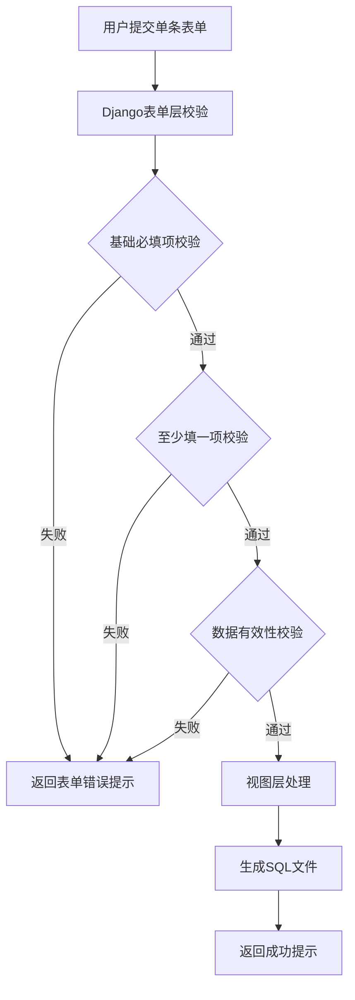
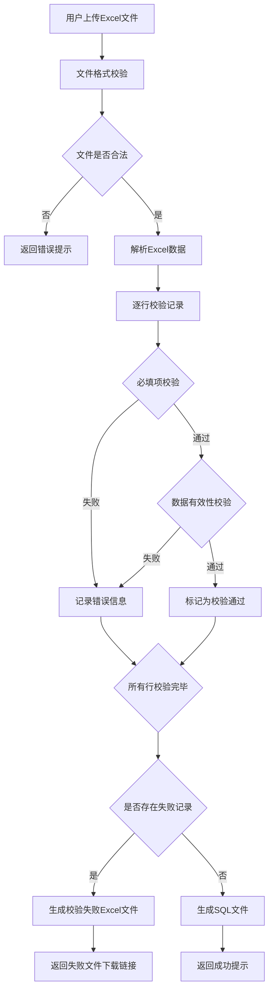

# 表单必填项验证设计文档

## 一、需求概述

### 1.1 业务背景

系统现有 16 个数据维护页面，需要增强单条提交和批量导入场景下的必填项校验能力，确保数据完整性和操作可靠性。当批量导入时，校验不通过的记录需要在原 Excel 文件上标注错误原因，并生成失败文件供用户下载修正。

### 1.2 核心目标

- 在表单层面和视图层面实施双层必填项校验
- 批量导入时对必填项缺失或数据校验失败的记录生成带错误信息的失败文件
- 保证单条提交和批量导入的校验规则一致性
- 对依赖数据查询的字段，查询失败时明确提示并阻止生成

### 1.3 涉及页面范围

合同明细单价修改、合同物资编码修改、合同预算修改、合同失效日期修改、适用清单修改、合同状态修改、合同创建人修改、终止合同、终止简化寻源合同、合同起草签约单位修改、是否报送国资委、物项重要性修改、浮动单价类型修改、核电 ERP 终止工具、项目轮次、需求计划明细日期修改、订单执行人修改

---

## 二、验证规则矩阵

### 2.1 单条模式必填项规则

| 页面功能             | 单条必填字段                                                                               | 至少填一项字段组                                                                              | 数据有效性校验                                               |
| -------------------- | ------------------------------------------------------------------------------------------ | --------------------------------------------------------------------------------------------- | ------------------------------------------------------------ |
| 合同明细单价修改     | 合同明细行 ID（单条）                                                                      | -                                                                                             | -                                                            |
| 合同物资编码修改     | 合同明细行 ID（单条）<br>新物资编码                                                        | -                                                                                             | 原物资编码查询：如查询失败且未手动补充其他物资字段，禁止生成 |
| 合同预算修改         | 询价单标段编号（单条）                                                                     | -                                                                                             | -                                                            |
| 合同失效日期修改     | 合同编号（单条）<br>新失效日期（YYYYMMDD）                                                 | -                                                                                             | 新失效日期格式：YYYYMMDD                                     |
| 适用清单修改         | 合同 ID（BUSINESS_ID）<br>新组织机构名称                                                   | -                                                                                             | 新组织机构名称查询：如查询不到对应编码，禁止生成             |
| 合同状态修改         | 合同编号（单条）<br>新合同状态                                                             | -                                                                                             | -                                                            |
| 合同创建人修改       | 合同号（BPO_ID）<br>创建人账号（BPO_EDIT_PERSON）                                          | -                                                                                             | 创建人账号查询：需在用户表中存在                             |
| 终止合同             | 合同 ID（单条）                                                                            | -                                                                                             | -                                                            |
| 终止简化寻源合同     | 合同 ID（单条）                                                                            | -                                                                                             | -                                                            |
| 合同起草签约单位修改 | -                                                                                          | 新起草单位名称/新签约主体名称（至少一项）<br>采购方案编号/询价单编号/定标结果编号（至少一项） | 起草单位名称、签约主体名称查询：如查询不到对应编码，禁止生成 |
| 是否报送国资委       | 是否报送                                                                                   | 采购方案编号/询价单编号/合同编号（至少一项）                                                  | -                                                            |
| 物项重要性修改       | 物项重要性（单条）                                                                         | 采购方案编号/询价单编号/合同编号（至少一项）                                                  | -                                                            |
| 浮动单价类型修改     | 合同编号（单条）                                                                           | -                                                                                             | -                                                            |
| 核电 ERP 终止工具    | 询价单编号（单条）<br>采购方案编号（单条）<br>采购包编号（单条，对应 PURCHASE_PACKAGE_NO） | -                                                                                             | -                                                            |
| 项目轮次             | 采购方案编号（单条）<br>物理轮次（单条）<br>原物理轮次（用于回退）                         | -                                                                                             | -                                                            |
| 需求计划明细日期修改 | 明细行号（单条）                                                                           | 需用日期（YYYYMMDD）/开始日期（YYYYMMDD）/结束日期（YYYYMMDD）（至少一项）                    | 日期格式：YYYYMMDD                                           |
| 订单执行人修改       | 订单执行人账号（ORDER_EXECUTOR）                                                           | 采购包编号（PURCHASE_PACKAGE_NO）/订单号（ORDER_ID）（至少一项）                              | 订单执行人账号查询：需在用户表中存在                         |

### 2.2 批量导入额外校验规则

批量导入模式下，除满足单条模式的所有必填项和有效性校验外，还需满足：

| 校验类型           | 校验规则                                                                           | 失败处理                                                                         |
| ------------------ | ---------------------------------------------------------------------------------- | -------------------------------------------------------------------------------- |
| 模板完整性校验     | Excel 必须包含所有必填列                                                           | 返回失败文件，在校验结果列标注缺失的必填列名                                     |
| 数据有效性校验     | 需要数据库查询的字段（如组织机构名称、创建人账号、订单执行人账号等），如查询失败   | 返回失败文件，在校验结果列标注"XX 不存在"或"XX 查询失败"                         |
| 依赖字段完整性校验 | 如原物资编码查询失败，需检查用户是否手动补充了新物资名称、计量单位、分类编码等字段 | 返回失败文件，标注"原物资编码查询失败，请手动补充新物资名称、计量单位、分类编码" |

---

## 三、校验流程设计

### 3.1 单条提交校验流程



### 3.2 批量导入校验流程



### 3.3 校验失败 Excel 生成流程

```mermaid
graph TD
    A[接收上传的Excel] --> B[调用openpyxl加载工作簿]
    B --> C[在最后一列添加"校验结果"列]
    C --> D[遍历校验结果数组]
    D --> E{当前行是否校验通过}
    E -->|通过| F[校验结果列留空]
    E -->|失败| G[校验结果列写入错误信息]
    F --> H{是否还有更多行}
    G --> H
    H -->|是| D
    H -->|否| I[保存到临时目录]
    I --> J[生成带时间戳的文件名]
    J --> K[返回文件路径]
```

---

## 四、技术实现策略

### 4.1 表单层校验增强

#### 4.1.1 必填项校验（Django Form clean 方法）

在 forms.py 中为每个表单类增强 clean 方法，实现以下逻辑：

**基础必填项校验**

- 检查单条模式下的必填字段是否为空
- 如为空，抛出 ValidationError 并提示字段名称

**至少填一项校验**

- 对于需要至少填一项的字段组，检查是否至少有一个字段有值
- 如全部为空，抛出 ValidationError 并提示可选字段列表

**示例结构**（以合同明细单价修改为例）：

- 单条模式必填项：single_line_id（合同明细行 ID）
- 校验逻辑：如填写 single_line_id 但未填写 Excel，需确保 single_line_id 不为空

#### 4.1.2 数据有效性校验（表单层前置校验）

对于需要数据库查询验证的字段，在表单 clean 方法中进行前置校验：

**创建人账号校验**（合同创建人修改）

- 查询 UserOrgDetail 表，检查 login_name 是否存在
- 如不存在，抛出 ValidationError 提示"创建人账号不存在"

**订单执行人账号校验**（订单执行人修改）

- 查询 UserOrgDetail 表，检查 login_name 是否存在
- 如不存在，抛出 ValidationError 提示"订单执行人账号不存在"

### 4.2 视图层校验实现

#### 4.2.1 Excel 解析层必填项校验

在 parse_excel 函数中增加必填列检查逻辑：

**列名映射验证**

- 定义必填列名列表（支持中文列名、英文列名、数据库字段名多种形式）
- 检查 Excel 表头是否包含所有必填列
- 如缺失必填列，抛出 ValueError 并明确提示缺失的列名

**数据行必填项校验**

- 在解析每一行数据时，检查必填列的值是否为空
- 如为空，跳过该行或记录到错误信息中（取决于是否使用校验失败文件机制）

#### 4.2.2 批量校验逻辑

在视图函数中，解析 Excel 后调用 validate_records 函数进行批量校验：

**校验函数结构**

- 输入：记录列表（从 Excel 解析得到）
- 输出：校验结果字典，包含总行数、通过行数、失败行数、详细错误列表

**逐行校验步骤**

1. 调用 validate_required 检查必填字段
2. 调用 validate_date_format 检查日期格式字段
3. 调用 validate_reference 检查数据库引用字段（如创建人账号、组织机构名称）
4. 调用 validate_at_least_one 检查至少填一项字段组
5. 对于合同物资编码修改，额外检查原物资编码查询失败时是否手动补充了其他字段
6. 将所有错误信息收集到 errors 列表中
7. 如 errors 列表为空，标记为校验通过；否则标记为失败并记录错误信息

**校验结果结构**

```
validation_result = {
    'valid': True/False,  # 是否全部通过
    'total': 100,  # 总行数
    'passed': 95,  # 通过行数
    'failed': 5,   # 失败行数
    'results': [
        {
            'row_number': 2,  # Excel行号（跳过表头）
            'valid': True,
            'errors': []
        },
        {
            'row_number': 3,
            'valid': False,
            'errors': ['合同明细行ID不能为空', '新单价不能为空']
        },
        ...
    ]
}
```

#### 4.2.3 校验失败处理流程

当 validation_result['valid']为 False 时：

**调用 generate_validation_failure_excel 函数**

- 输入：上传的 Excel 文件对象、校验结果字典、模块名称
- 处理：重新读取上传的 Excel 文件，在最后一列添加"校验结果"列，填充错误信息
- 输出：临时文件路径

**生成失败文件信息**

- 从临时文件路径中提取文件名
- 构造 validation_failure 字典，包含总行数、通过行数、失败行数、文件名
- 将 validation_failure 传递给模板进行渲染

**模板展示**

- 在页面顶部显示校验失败提示框，包含失败行数统计
- 提供下载失败文件的链接，用户可下载修正后重新上传

### 4.3 工具函数复用

#### 4.3.1 validation_utils.py 工具函数

**validate_required(value, field_name)**

- 功能：检查字段是否为空
- 返回：错误信息字符串或 None

**validate_date_format(value, field_name, date_format='%Y%m%d')**

- 功能：检查日期格式是否为 YYYYMMDD
- 返回：错误信息字符串或 None

**validate_reference(value, field_name, model_class, query_field='id')**

- 功能：检查值在数据库中是否存在
- 返回：错误信息字符串或 None

**validate_at_least_one(values, field_names)**

- 功能：检查字段组中是否至少有一个有值
- 返回：错误信息字符串或 None

**generate_validation_failure_excel(uploaded_file, validation_result, module_name)**

- 功能：生成带错误信息的校验失败 Excel 文件
- 返回：临时文件路径或 None

**save_validation_temp_file(workbook, module_name)**

- 功能：保存校验失败文件到临时目录
- 返回：文件完整路径

**get_temp_filename_from_path(filepath)**

- 功能：从完整路径中提取文件名
- 返回：文件名

#### 4.3.2 自定义校验函数

对于特定页面的复杂校验逻辑，需在对应视图文件中实现自定义校验函数：

**合同物资编码修改页面**

- 定义 validate_item_record 函数
- 检查原物资编码查询是否成功
- 如查询失败，检查是否手动补充了新物资名称、计量单位、分类编码
- 如未补充，返回错误信息"原物资编码查询失败，请手动补充新物资名称、计量单位、分类编码"

**适用清单修改页面**

- 定义 validate_org_record 函数
- 检查新组织机构名称查询是否成功
- 如查询失败，返回错误信息"新组织机构名称查询失败，请检查名称是否正确"

**合同起草签约单位修改页面**

- 定义 validate_unit_record 函数
- 检查新起草单位名称或新签约主体名称查询是否成功
- 如查询失败，返回错误信息"起草单位名称/签约主体名称查询失败"

---

## 五、页面级实施细则

### 5.1 合同明细单价修改（contract_price.py）

#### 必填项要求

- 单条模式：合同明细行 ID（single_line_id）必填
- 批量模式：Excel 必须包含"明细行 ID"列，且每行该列不能为空

#### 表单校验增强

在 ContractDetailPriceForm 的 clean 方法中添加：

- 检查单条模式下 single_line_id 是否为空
- 如为空，抛出 ValidationError："合同明细行 ID 不能为空"

#### 视图层校验

在 parse_price_excel 函数中：

- 检查 Excel 是否包含明细行 ID 列（支持'line_id', 'BPO_LINE_ID', '明细行 ID'）
- 如缺失，抛出 ValueError："Excel 缺少必要列：明细行 ID"
- 在解析每行时，如明细行 ID 为空，记录错误："第 X 行：合同明细行 ID 不能为空"

在 contract_price_view 函数中：

- 调用 validate_records 函数对批量数据进行校验
- 如 validation_result['valid']为 False，调用 generate_validation_failure_excel 生成失败文件
- 返回 validation_failure 信息给模板

### 5.2 合同物资编码修改（contract_item.py）

#### 必填项要求

- 单条模式：合同明细行 ID（single_line_id）必填，新物资编码（new_item_id）必填
- 批量模式：Excel 必须包含"明细行 ID"列，每行该列不能为空

#### 数据有效性校验

- 原物资编码查询失败时，需检查是否手动补充了新物资名称、计量单位、分类编码
- 如未补充，禁止生成 SQL

#### 表单校验增强

在 ContractItemUpdateForm 的 clean 方法中：

- 单条模式下，检查 single_line_id 和 new_item_id 是否为空
- 如为空，抛出 ValidationError

#### 视图层校验

在 parse_item_excel 函数中：

- 检查 Excel 是否包含明细行 ID 列
- 如缺失，抛出 ValueError

在 contract_item_view 函数中：

- 定义 validate_item_record 函数，实现物资编码查询逻辑
- 如原物资编码查询失败且未手动补充其他字段，记录错误："原物资编码查询失败，请手动补充新物资名称、计量单位、分类编码"
- 调用 validate_records 函数进行批量校验
- 如校验失败，生成失败文件并返回

### 5.3 合同预算修改（contract_budget.py）

#### 必填项要求

- 单条模式：询价单标段编号（section_no）必填
- 批量模式：Excel 必须包含"询价单标段编号"列，且每行该列不能为空

#### 表单校验增强

在 ContractBudgetUpdateForm 的 clean 方法中：

- 单条模式下，检查 section_no 是否为空
- 如为空，抛出 ValidationError："询价单标段编号不能为空"

#### 视图层校验

在 parse_budget_excel 函数中：

- 检查 Excel 是否包含询价单标段编号列（支持'section_no', 'SECTION_NO', '询价单标段编号'）
- 如缺失，抛出 ValueError："Excel 缺少必要列：询价单标段编号"
- 在解析每行时，如询价单标段编号为空，记录错误："第 X 行：询价单标段编号不能为空"

在 contract_budget_view 函数中：

- 调用 validate_records 函数对批量数据进行校验
- 如校验失败，生成失败文件并返回

### 5.4 合同失效日期修改（enddate.py）

#### 必填项要求

- 单条模式：合同编号（bpo_id）必填，新失效日期（end_date）必填
- 批量模式：Excel 必须包含"合同编号"和"新失效日期"列，且每行这两列不能为空

#### 数据格式校验

- 新失效日期格式必须为 YYYYMMDD

#### 表单校验增强

在 EndDateUpdateForm 的 clean 方法中：

- 单条模式下，检查 bpo_id 和 end_date 是否为空
- 如为空，抛出 ValidationError

#### 视图层校验

在 parse_enddate_excel 函数中：

- 检查 Excel 是否包含合同编号和新失效日期列
- 如缺失，抛出 ValueError

在 enddate_view 函数中：

- 调用 validate_records 函数，对每行数据进行校验
- 调用 validate_required 检查合同编号和新失效日期
- 调用 validate_date_format 检查新失效日期格式
- 如校验失败，生成失败文件并返回

### 5.5 适用清单修改（use_list.py）

#### 必填项要求

- 单条模式：合同 ID（business_id）必填，新组织机构名称（new_org_name）必填
- 批量模式：Excel 必须包含"BUSINESS_ID"和"新组织机构名称"列，且每行这两列不能为空

#### 数据有效性校验

- 新组织机构名称需能查询到对应的组织机构编码
- 如查询失败，禁止生成 SQL

#### 表单校验增强

在 UseListUpdateForm 的 clean 方法中：

- 单条模式下，检查 business_id 和 new_org_name 是否为空
- 如为空，抛出 ValidationError

#### 视图层校验

在 parse_uselist_excel 函数中：

- 检查 Excel 是否包含 BUSINESS_ID 和新组织机构名称列
- 如缺失，抛出 ValueError

在 use_list_view 函数中：

- 定义 validate_org_record 函数，实现组织机构名称查询逻辑
- 如查询失败，记录错误："新组织机构名称查询失败，请检查名称是否正确"
- 调用 validate_records 函数进行批量校验
- 如校验失败，生成失败文件并返回

### 5.6 合同状态修改（appr_state.py）

#### 必填项要求

- 单条模式：合同编号（bpo_id）必填，新合同状态（new_appr_state）必填
- 批量模式：Excel 必须包含"合同 ID"和"新合同状态"列，且每行这两列不能为空

#### 表单校验增强

在 ApprStateChangeForm 的 clean 方法中：

- 单条模式下，检查 bpo_id 和 new_appr_state 是否为空
- 如为空，抛出 ValidationError

#### 视图层校验

在 parse_apprstate_excel 函数中：

- 检查 Excel 是否包含合同 ID 和新合同状态列
- 如缺失，抛出 ValueError

在 appr_state_view 函数中：

- 调用 validate_records 函数对批量数据进行校验
- 如校验失败，生成失败文件并返回

### 5.7 合同创建人修改（contract_creator.py）

#### 必填项要求

- 单条模式：合同号（bpo_id）必填，创建人账号（creator_account）必填
- 批量模式：Excel 必须包含"合同号"和"创建人账号"列，且每行这两列不能为空

#### 数据有效性校验

- 创建人账号需在 UserOrgDetail 表中存在
- 如不存在，禁止生成 SQL

#### 表单校验增强

在 ContractCreatorForm 的 clean 方法中：

- 单条模式下，检查 bpo_id 和 creator_account 是否为空
- 调用 UserOrgDetail.objects.filter(login_name=creator_account).exists()检查创建人账号是否存在
- 如不存在，抛出 ValidationError："创建人账号不存在，请检查后重试"

#### 视图层校验

在 parse_creator_excel 函数中：

- 检查 Excel 是否包含合同号和创建人账号列
- 如缺失，抛出 ValueError

在 contract_creator_view 函数中：

- 调用 validate_records 函数，对每行数据进行校验
- 调用 validate_required 检查合同号和创建人账号
- 调用 validate_reference 检查创建人账号在 UserOrgDetail 表中是否存在
- 如校验失败，生成失败文件并返回

### 5.8 终止合同（contract_terminate.py）

#### 必填项要求

- 单条模式：合同 ID（bpo_id）必填
- 批量模式：Excel 必须包含"合同 ID"列，且每行该列不能为空

#### 表单校验增强

在 ContractTerminateForm 的 clean 方法中：

- 单条模式下，检查 bpo_id 是否为空
- 如为空，抛出 ValidationError："合同 ID 不能为空"

#### 视图层校验

在 parse_terminate_excel 函数中：

- 检查 Excel 是否包含合同 ID 列
- 如缺失，抛出 ValueError

在 contract_terminate_view 函数中：

- 调用 validate_records 函数对批量数据进行校验
- 如校验失败，生成失败文件并返回

### 5.9 终止简化寻源合同（sourcing_terminate.py）

#### 必填项要求

- 单条模式：合同 ID（bpo_id）必填
- 批量模式：Excel 必须包含"合同 ID"列，且每行该列不能为空

#### 表单校验增强

在 SourcingTerminateForm 的 clean 方法中：

- 单条模式下，检查 bpo_id 是否为空
- 如为空，抛出 ValidationError："合同 ID 不能为空"

#### 视图层校验

在 parse_sourcing_terminate_excel 函数中：

- 检查 Excel 是否包含合同 ID 列
- 如缺失，抛出 ValueError

在 sourcing_terminate_view 函数中：

- 调用 validate_records 函数对批量数据进行校验
- 如校验失败，生成失败文件并返回

### 5.10 合同起草签约单位修改（contract_unit.py）

#### 必填项要求

- 单条模式：
  - 新起草单位名称、新签约主体名称至少填一项
  - 采购方案编号、询价单编号、定标结果编号至少填一项
- 批量模式：Excel 必须包含上述至少填一项字段组的列

#### 数据有效性校验

- 新起草单位名称、新签约主体名称需能查询到对应的组织机构编码
- 如查询失败，禁止生成 SQL

#### 表单校验增强

在 UnitChangeForm 的 clean 方法中：

- 检查新起草单位名称和新签约主体名称是否至少有一项有值
- 检查采购方案编号、询价单编号、定标结果编号是否至少有一项有值
- 如全部为空，抛出 ValidationError

#### 视图层校验

在 parse_unit_excel 函数中：

- 检查 Excel 是否包含至少一项新单位名称列和至少一项编号列
- 如缺失，抛出 ValueError

在 contract_unit_view 函数中：

- 定义 validate_unit_record 函数，实现单位名称查询逻辑
- 如查询失败，记录错误："起草单位名称/签约主体名称查询失败"
- 调用 validate_records 函数，对每行数据进行校验
- 调用 validate_at_least_one 检查至少填一项字段组
- 如校验失败，生成失败文件并返回

### 5.11 是否报送国资委（gov_report.py）

#### 必填项要求

- 单条模式：
  - 采购方案编号、询价单编号、合同编号至少填一项
  - 是否报送必选
- 批量模式：Excel 必须包含至少一项编号列和是否报送列

#### 表单校验增强

在 GovReportForm 的 clean 方法中：

- 检查采购方案编号、询价单编号、合同编号是否至少有一项有值
- 检查是否报送字段是否已选择
- 如不满足，抛出 ValidationError

#### 视图层校验

在 parse_govreport_excel 函数中：

- 检查 Excel 是否包含至少一项编号列和是否报送列
- 如缺失，抛出 ValueError

在 gov_report_view 函数中：

- 调用 validate_records 函数，对每行数据进行校验
- 调用 validate_at_least_one 检查至少填一项编号字段
- 调用 validate_required 检查是否报送字段
- 如校验失败，生成失败文件并返回

### 5.12 物项重要性修改（importance.py）

#### 必填项要求

- 单条模式：
  - 采购方案编号、询价单编号、合同编号至少填一项
  - 物项重要性（单条）必选
- 批量模式：Excel 必须包含至少一项编号列和物项重要性列

#### 表单校验增强

在 ImportanceForm 的 clean 方法中：

- 检查采购方案编号、询价单编号、合同编号是否至少有一项有值
- 检查物项重要性字段是否已选择
- 如不满足，抛出 ValidationError

#### 视图层校验

在 parse_importance_excel 函数中：

- 检查 Excel 是否包含至少一项编号列和物项重要性列
- 如缺失，抛出 ValueError

在 importance_view 函数中：

- 调用 validate_records 函数，对每行数据进行校验
- 调用 validate_at_least_one 检查至少填一项编号字段
- 调用 validate_required 检查物项重要性字段
- 如校验失败，生成失败文件并返回

### 5.13 浮动单价类型修改（price_type.py）

#### 必填项要求

- 单条模式：合同编号（bpo_id）必填
- 批量模式：Excel 必须包含"合同编号"列，且每行该列不能为空

#### 表单校验增强

在 FloatingPriceTypeForm 的 clean 方法中：

- 单条模式下，检查 bpo_id 是否为空
- 如为空，抛出 ValidationError："合同编号不能为空"

#### 视图层校验

在 parse_pricetype_excel 函数中：

- 检查 Excel 是否包含合同编号列
- 如缺失，抛出 ValueError

在 price_type_view 函数中：

- 调用 validate_records 函数对批量数据进行校验
- 如校验失败，生成失败文件并返回

### 5.14 核电 ERP 终止工具（erp_terminate.py）

#### 必填项要求

- 单条模式：询价单编号（inq_id）、采购方案编号（purchase_scheme_no）、采购包编号（purchase_package_no，对应 PURCHASE_PACKAGE_NO）三者都必填
- 批量模式：Excel 必须包含这三列，且每行这三列不能为空

#### 界面调整

- 将 PURCHASE_PACKAGE_NO 显示名称更名为"采购包编号（单条）"

#### 表单校验增强

在 ErpTerminateForm 的 clean 方法中：

- 单条模式下，检查 inq_id、purchase_scheme_no、purchase_package_no 是否全部有值
- 如有任一为空，抛出 ValidationError："询价单编号、采购方案编号、采购包编号都为必填项"

#### 视图层校验

在 parse_erp_excel 函数中：

- 检查 Excel 是否包含询价单编号、采购方案编号、采购包编号三列
- 如缺失任一列，抛出 ValueError

在 erp_terminate_view 函数中：

- 调用 validate_records 函数，对每行数据进行校验
- 调用 validate_required 分别检查三个必填字段
- 如校验失败，生成失败文件并返回

### 5.15 项目轮次（project_round.py）

#### 必填项要求

- 单条模式：采购方案编号（scheme_no）、物理轮次（round_number）、原物理轮次（orig_round_number，用于回退）全部必填
- 批量模式：Excel 必须包含这三列，且每行这三列不能为空

#### 表单校验增强

在 ProjectRoundForm 的 clean 方法中：

- 单条模式下，检查 scheme_no、round_number、orig_round_number 是否全部有值
- 如有任一为空，抛出 ValidationError："采购方案编号、物理轮次、原物理轮次都为必填项"

#### 视图层校验

在 parse_round_excel 函数中：

- 检查 Excel 是否包含采购方案编号、物理轮次、原物理轮次三列
- 如缺失任一列，抛出 ValueError

在 project_round_view 函数中：

- 调用 validate_records 函数，对每行数据进行校验
- 调用 validate_required 分别检查三个必填字段
- 如校验失败，生成失败文件并返回

### 5.16 需求计划明细日期修改（plan_date.py）

#### 必填项要求

- 单条模式：
  - 明细行号（line_no）必填
  - 需用日期（need_date）、开始日期（start_date）、结束日期（end_date）至少填一项
- 批量模式：Excel 必须包含明细行号列和至少一项日期列

#### 数据格式校验

- 日期格式必须为 YYYYMMDD

#### 表单校验增强

在 PlanDateUpdateForm 的 clean 方法中：

- 单条模式下，检查 line_no 是否为空
- 检查需用日期、开始日期、结束日期是否至少有一项有值
- 如不满足，抛出 ValidationError

#### 视图层校验

在 parse_plandate_excel 函数中：

- 检查 Excel 是否包含明细行号列和至少一项日期列
- 如缺失，抛出 ValueError

在 plan_date_view 函数中：

- 调用 validate_records 函数，对每行数据进行校验
- 调用 validate_required 检查明细行号
- 调用 validate_at_least_one 检查至少填一项日期字段
- 调用 validate_date_format 分别检查日期格式
- 如校验失败，生成失败文件并返回

### 5.17 订单执行人修改（order_executor.py）

#### 必填项要求

- 单条模式：
  - 采购包编号（purchase_package_no）、订单号（order_id）至少填一项
  - 订单执行人账号（order_executor）必填
- 批量模式：Excel 必须包含至少一项编号列和订单执行人账号列

#### 数据有效性校验

- 订单执行人账号需在 UserOrgDetail 表中存在
- 如不存在，禁止生成 SQL

#### 表单校验增强

在 OrderExecutorForm 的 clean 方法中：

- 检查采购包编号和订单号是否至少有一项有值
- 检查订单执行人账号是否为空
- 调用 UserOrgDetail.objects.filter(login_name=order_executor).exists()检查订单执行人账号是否存在
- 如不存在，抛出 ValidationError："订单执行人账号不存在，请检查后重试"

#### 视图层校验

在 parse_executor_excel 函数中：

- 检查 Excel 是否包含至少一项编号列和订单执行人账号列
- 如缺失，抛出 ValueError

在 order_executor_view 函数中：

- 调用 validate_records 函数，对每行数据进行校验
- 调用 validate_at_least_one 检查至少填一项编号字段
- 调用 validate_required 检查订单执行人账号
- 调用 validate_reference 检查订单执行人账号在 UserOrgDetail 表中是否存在
- 如校验失败，生成失败文件并返回

---

## 六、模板展示层增强

### 6.1 校验失败提示框

在各页面模板中增加校验失败提示框，展示校验结果统计和失败文件下载链接：

**提示框结构**

- 背景色：浅红色（#f8d7da）
- 边框色：红色（#f5c6cb）
- 内容：
  - 标题：数据校验失败
  - 统计信息：总行数、通过行数、失败行数
  - 下载链接：点击下载失败文件，查看详细错误信息

**模板代码示例**

```

<div style="margin-top: 20px; padding: 15px; background: #f8d7da; border-radius: 8px; border: 1px solid #f5c6cb;">
  <strong style="color: #721c24">❌ 数据校验失败</strong>
  <div style="margin-top: 8px; color: #721c24; font-size: 13px">
    总行数: {{ validation_failure.total }} | 通过行数: {{ validation_failure.passed }} | 失败行数: {{ validation_failure.failed }}
  </div>
  <div style="margin-top: 8px;">
    <a href="" style="color: #0056b3; font-weight: 600;">
      ⬇ 下载失败文件查看详细错误信息
    </a>
  </div>
</div>

```

### 6.2 失败文件下载路由

在 urls.py 中增加失败文件下载路由：

**路由定义**

- 路径：/download-validation-failure/<filename>/
- 视图函数：download_validation_failure
- 功能：根据文件名从临时目录读取文件并返回 FileResponse

**视图函数实现**

- 验证文件名合法性，防止路径穿越攻击
- 拼接临时目录路径和文件名
- 检查文件是否存在
- 返回 FileResponse，设置 as_attachment=True 和正确的 Content-Type

---

## 七、错误信息标准化

### 7.1 必填项错误信息格式

**单字段必填错误**

- 格式：{字段名称}不能为空
- 示例：合同明细行 ID 不能为空、创建人账号不能为空

**至少填一项错误**

- 格式：必须填写{字段 1}/{字段 2}/{字段 3}至少一个
- 示例：必须填写采购方案编号/询价单编号/合同编号至少一个

### 7.2 数据有效性错误信息格式

**日期格式错误**

- 格式：{字段名称}格式错误，应为 YYYYMMDD 格式
- 示例：新失效日期格式错误，应为 YYYYMMDD 格式

**数据库引用错误**

- 格式：{字段名称}不存在
- 示例：创建人账号不存在、订单执行人账号不存在

**查询失败且未补充错误**

- 格式：{字段名称}查询失败，请手动补充{依赖字段列表}
- 示例：原物资编码查询失败，请手动补充新物资名称、计量单位、分类编码

### 7.3 Excel 列缺失错误信息格式

**单列缺失错误**

- 格式：Excel 缺少必要列：{列名}
- 示例：Excel 缺少必要列：明细行 ID

**多列缺失错误**

- 格式：Excel 缺少必要列：{列名 1}、{列名 2}、{列名 3}
- 示例：Excel 缺少必要列：询价单编号、采购方案编号、采购包编号

---

## 八、实施优先级与阶段划分

### 8.1 第一阶段（高优先级）

**包含页面**

- 合同明细单价修改
- 合同物资编码修改
- 合同预算修改
- 合同失效日期修改
- 适用清单修改
- 合同状态修改
- 合同创建人修改

**实施内容**

- 表单层必填项校验
- 视图层批量校验逻辑
- 校验失败文件生成机制
- 模板展示层增强

### 8.2 第二阶段（中优先级）

**包含页面**

- 终止合同
- 终止简化寻源合同
- 合同起草签约单位修改
- 是否报送国资委
- 物项重要性修改
- 浮动单价类型修改

**实施内容**

- 同第一阶段内容
- 至少填一项字段组校验逻辑

### 8.3 第三阶段（常规优先级）

**包含页面**

- 核电 ERP 终止工具
- 项目轮次
- 需求计划明细日期修改
- 订单执行人修改

**实施内容**

- 同前两阶段内容
- 多必填字段组合校验
- 日期格式校验

---

## 九、测试策略

### 9.1 单元测试

**表单校验测试**

- 测试必填项为空时是否抛出 ValidationError
- 测试至少填一项字段组全部为空时是否抛出 ValidationError
- 测试数据库引用字段不存在时是否抛出 ValidationError

**工具函数测试**

- 测试 validate_required 函数对空值的识别
- 测试 validate_date_format 函数对日期格式的校验
- 测试 validate_reference 函数对数据库查询的准确性
- 测试 validate_at_least_one 函数对字段组的校验逻辑

### 9.2 集成测试

**单条提交场景**

- 必填项为空时，页面应显示错误提示，不生成 SQL 文件
- 必填项齐全时，应成功生成 SQL 文件并显示成功提示

**批量导入场景**

- Excel 缺少必填列时，应显示错误提示，不生成 SQL 文件
- Excel 必填列存在空值时，应生成校验失败文件，显示失败统计和下载链接
- Excel 数据全部通过校验时，应成功生成 SQL 文件并显示成功提示
- 下载失败文件后，打开 Excel 应能看到"校验结果"列及具体错误信息

### 9.3 用户验收测试

**测试用例设计**

- 准备包含必填项缺失、日期格式错误、数据库引用不存在等错误的 Excel 文件
- 上传后检查校验失败文件是否正确标注错误信息
- 修正错误后重新上传，检查是否能成功生成 SQL 文件

**边界条件测试**

- 测试 Excel 文件为空时的处理
- 测试 Excel 仅包含表头无数据行时的处理
- 测试 Excel 中部分行校验通过、部分行失败时的处理

---

## 十、风险与注意事项

### 10.1 性能风险

**批量校验性能**

- 当 Excel 包含大量数据（如超过 5000 行）时，逐行校验可能耗时较长
- 缓解措施：
  - 在前端限制 Excel 文件大小（如不超过 10MB）
  - 对数据库查询进行批量优化，避免逐条查询
  - 在校验过程中记录日志，便于监控性能瓶颈

**失败文件生成性能**

- 重新读取 Excel 并写入校验结果列可能耗时
- 缓解措施：
  - 使用 openpyxl 的 data_only 模式读取 Excel，避免公式计算
  - 仅在校验失败时生成失败文件，减少不必要的文件操作

### 10.2 兼容性风险

**Excel 格式兼容性**

- 用户可能上传.xls 格式文件，openpyxl 仅支持.xlsx 格式
- 缓解措施：
  - 在前端和后端同时校验文件扩展名，仅接受.xlsx 格式
  - 在帮助文本中明确提示仅支持.xlsx 格式

**列名识别兼容性**

- 用户可能使用自定义列名，导致列名映射失败
- 缓解措施：
  - 在 Excel 模板中明确标注列名，建议用户不要修改
  - 在列名映射时支持多种常见别名（中文、英文、数据库字段名）

### 10.3 数据一致性风险

**数据库查询时效性**

- 在批量校验时查询数据库，可能因数据库数据更新导致校验结果与实际不符
- 缓解措施：
  - 校验时增加日志记录，记录查询时间和查询结果
  - 建议用户在校验通过后尽快执行 SQL，避免数据过期

**并发操作风险**

- 多个用户同时上传相同数据可能导致临时文件冲突
- 缓解措施：
  - 失败文件命名包含时间戳和用户标识，确保文件名唯一
  - 定期清理临时目录中的过期文件

### 10.4 用户体验风险

**错误信息过于技术化**

- 数据库错误信息可能包含 SQL 语句或技术术语，用户难以理解
- 缓解措施：
  - 对数据库异常进行捕获和转换，提供用户友好的错误提示
  - 在错误信息中提供操作建议，如"请检查名称是否正确"

**批量校验反馈不及时**

- 大量数据校验时，用户可能等待较长时间无反馈
- 缓解措施：
  - 在前端增加加载动画或进度提示
  - 记录详细日志，便于用户联系管理员查询进度
