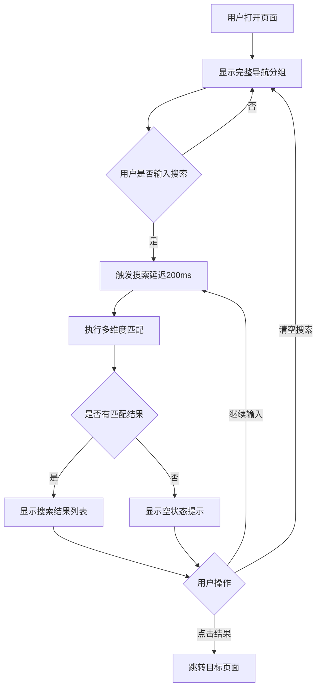

# 导航栏模糊搜索功能设计

## 一、需求背景

当前系统导航栏包含5个分组共18个功能菜单项，随着功能增多，用户需要通过折叠/展开分组逐个查找目标页面，操作效率较低。需要提供模糊搜索能力，支持用户通过关键词快速定位并跳转到目标页面。

## 二、功能目标

为侧边栏导航提供实时模糊搜索功能，允许用户：
- 通过输入关键词快速筛选导航项
- 支持拼音首字母、全拼、汉字、部分匹配
- 即时显示匹配结果并高亮匹配部分
- 点击搜索结果直接跳转到目标页面

## 三、核心功能设计

### 3.1 搜索框位置与样式

在侧边栏顶部品牌标题"工作集"下方放置搜索框，包含以下元素：

| 元素 | 说明 |
|------|------|
| 搜索输入框 | 占据侧边栏宽度，带搜索图标前缀 |
| 占位提示 | 显示"搜索功能菜单..."引导用户 |
| 清空按钮 | 当输入内容时显示，点击清空搜索 |
| 视觉风格 | 与现有侧边栏样式保持一致，圆角、边框、聚焦态 |

### 3.2 搜索数据源结构

基于现有的 `SIDEBAR_GROUPS` 数据结构构建搜索索引：

| 字段 | 说明 | 示例 |
|------|------|------|
| 导航标签 | 菜单项的显示名称 | "明细单价修改" |
| 分组名称 | 所属的导航分组 | "合同" |
| URL名称 | Django路由名称 | "contract_price" |
| 拼音全拼 | 标签的拼音全拼 | "mingxidanjiaxiugai" |
| 拼音首字母 | 标签的首字母缩写 | "mxdjxg" |
| 完整搜索路径 | 分组+标签组合 | "合同 明细单价修改" |

### 3.3 搜索匹配策略

采用多维度模糊匹配机制，按优先级排序：

| 优先级 | 匹配类型 | 说明 | 示例 |
|--------|---------|------|------|
| 1 | 标签精确匹配 | 输入与标签完全一致 | 输入"明细单价修改" |
| 2 | 标签开头匹配 | 标签以输入开头 | 输入"明细" 匹配 "明细单价修改" |
| 3 | 拼音首字母匹配 | 拼音缩写匹配 | 输入"mxdj" 匹配 "明细单价修改" |
| 4 | 拼音全拼匹配 | 完整拼音匹配 | 输入"mingxi" 匹配 "明细单价修改" |
| 5 | 标签包含匹配 | 标签中包含输入 | 输入"单价" 匹配 "明细单价修改" |
| 6 | 分组+标签匹配 | 跨分组和标签搜索 | 输入"合同单价" 匹配 "合同>明细单价修改" |

### 3.4 搜索结果展示

搜索结果实时显示在搜索框下方，替代原有的分组导航：

| 显示元素 | 说明 |
|----------|------|
| 结果列表 | 扁平化展示所有匹配项，不按分组折叠 |
| 分组标签 | 每个结果前显示所属分组（灰色小字） |
| 高亮匹配 | 匹配的关键词部分使用高亮样式 |
| 空状态提示 | 无匹配结果时显示"未找到匹配的菜单" |
| 结果数量限制 | 最多显示10条结果避免过长 |

### 3.5 交互行为

| 交互场景 | 行为说明 |
|----------|----------|
| 输入搜索 | 实时过滤，延迟200ms执行避免频繁计算 |
| 清空搜索 | 恢复显示原有分组导航结构 |
| 点击结果 | 直接跳转到目标页面，清空搜索状态 |
| 键盘导航 | 支持上下箭头选择结果，回车跳转 |
| 失焦行为 | 保留搜索结果，不自动清空 |

## 四、拼音转换方案

为支持拼音搜索，需要实现汉字转拼音功能：

### 4.1 实现方式选择

| 方案 | 优点 | 缺点 | 推荐度 |
|------|------|------|--------|
| 前端JavaScript库 | 客户端计算，无服务器压力 | 增加首屏加载体积 | ⭐⭐⭐ |
| 后端预生成 | 无前端性能损耗，数据量小 | 需修改后端数据结构 | ⭐⭐⭐⭐⭐ |

**推荐方案**：后端预生成拼音索引

在渲染侧边栏时，后端为每个导航项生成拼音数据并传递给前端，前端直接使用。

### 4.2 拼音数据注入结构

扩展传递给模板的 `sidebar_groups` 数据结构：

| 原有字段 | 新增字段 | 字段说明 |
|---------|---------|----------|
| label | label | 导航标签（保持不变） |
| url_name | url_name | 路由名称（保持不变） |
| - | pinyin_full | 拼音全拼，如 "mingxidanjiaxiugai" |
| - | pinyin_abbr | 拼音首字母，如 "mxdjxg" |
| - | group_name | 所属分组名称，便于搜索和显示 |

## 五、技术实现边界

### 5.1 前端实现范围

| 组件 | 职责 |
|------|------|
| 搜索框UI | 在 sidebar.html 中添加搜索输入框及样式 |
| 搜索逻辑 | JavaScript实现实时过滤、匹配、高亮 |
| 结果渲染 | 动态生成搜索结果DOM，控制显示/隐藏 |
| 交互控制 | 处理输入、清空、键盘导航等用户交互 |

### 5.2 后端实现范围

| 组件 | 职责 |
|------|------|
| 拼音转换工具 | 使用Python拼音库将导航标签转为拼音 |
| 数据结构扩展 | 在 navigation.py 或视图层扩展导航数据 |
| 模板上下文 | 将包含拼音信息的导航数据传递给模板 |

### 5.3 无需实现的功能

- 不需要持久化搜索历史
- 不需要搜索统计分析
- 不需要服务端搜索接口（纯前端实时搜索）

## 六、用户体验流程

## 七、边界情况处理

| 场景 | 处理策略 |
|------|----------|
| 输入空格 | 自动去除前后空格，连续空格视为一个 |
| 输入特殊字符 | 仅保留字母、数字、汉字参与匹配 |
| 输入超长文本 | 限制搜索框最大输入长度为30字符 |
| 多音字问题 | 使用拼音库默认读音，不做特殊处理 |
| 同时匹配多项 | 按优先级排序，最多显示10条 |
| 导航数据变化 | 页面刷新后自动同步最新导航数据 |

## 八、性能优化考量

| 优化项 | 说明 |
|--------|------|
| 防抖处理 | 输入延迟200ms后执行搜索，减少计算频率 |
| 数据预处理 | 页面加载时一次性构建搜索索引缓存 |
| DOM最小化 | 仅更新搜索结果区域，不重绘整个侧边栏 |
| 结果限制 | 最多显示10条结果，避免长列表渲染 |

## 九、可访问性要求

| 要求 | 说明 |
|------|------|
| 键盘访问 | 支持Tab聚焦搜索框，Escape清空搜索 |
| 语义化标签 | 搜索框使用input[type="search"] |
| 焦点管理 | 搜索结果支持键盘上下导航 |
| 屏幕阅读器 | 搜索框带有aria-label说明 |

## 十、后续扩展可能性

| 扩展方向 | 说明 |
|----------|------|
| 搜索历史 | 记录最近搜索的菜单项，快速访问 |
| 快捷键 | 支持快捷键（如Ctrl+K）快速聚焦搜索框 |
| 搜索建议 | 输入时显示热门搜索或推荐菜单 |
| 权重排序 | 根据用户访问频率调整搜索结果排序 || 搜索建议 | 输入时显示热门搜索或推荐菜单 |
