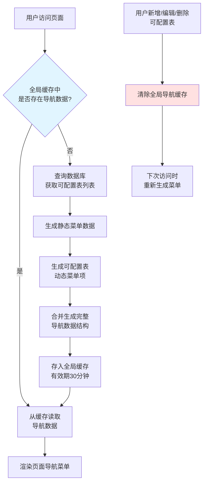
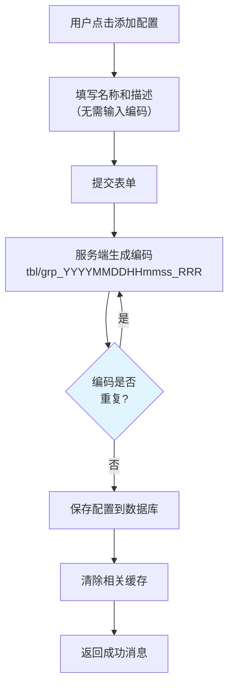

# 特殊模板配置优化设计

## 一、背景与问题分析

### 1.1 当前系统架构

系统包含两套配置管理机制：

**可配置表管理系统**

- 配置数据存储在 `ConfigurableTable` 和 `ConfigurableField` 两个数据模型中
- 导航菜单在 `navigation.py` 中通过 `_get_dynamic_configurable_items()` 函数动态生成特殊模板分组
- 菜单数据使用 Django 缓存机制，缓存键为 `configurable_tables`，缓存时长 30 分钟
- 导航数据在模块加载时通过 `SIDEBAR_GROUPS = _generate_sidebar_groups_with_pinyin()` 生成并固化

**下拉框配置管理系统**

- 配置数据存储在 `DropdownGroup` 和 `DropdownOption` 两个数据模型中
- 提供 `get_dropdown_options()` 工具函数供各功能模块调用
- 采用缓存机制，缓存键格式为 `dropdown_options_{group_code}`，缓存时长 30 分钟
- 分组编码需手动输入，配置项编码也需手动输入

### 1.2 核心问题识别

**问题 1：新增配置后菜单不刷新**

- 根因：`SIDEBAR_GROUPS` 在模块加载时（项目启动时）执行一次，之后不会重新生成
- 影响：即使清除了缓存，导航变量 `SIDEBAR_GROUPS` 仍然是旧的数据
- 场景：用户新增可配置表后，特殊模板分组菜单不显示新增项，必须重启项目

**问题 2：编码字段需要手动输入**

- 涉及范围：可配置表的 `table_code` 和下拉框分组的 `group_code`
- 根因：编码字段在添加时需要手动输入，但系统可自动生成唯一标识
- 影响：增加用户输入负担，且编码规则不统一，容易出错
- 使用场景：仅用作内部标识、URL 路径参数和缓存键，用户无需关心具体值

**问题 3：配置列表缺乏检索能力**

- 涉及范围：可配置表列表和下拉框分组列表
- 根因：左侧列表直接全量渲染，无搜索过滤功能
- 影响：当配置数量增多时，用户难以快速定位目标配置
- 场景：多个类似功能的配置时，需要逐个滚动查找

**问题 4：列表展示未考虑大数据量场景**

- 涉及范围：可配置表列表和下拉框分组列表
- 根因：页面采用一次性全量加载方式
- 影响：当配置数量较多（如超过 50 个）时，页面渲染性能下降，滚动体验差
- 场景：长期使用后积累大量配置项

**问题 5：字段类型单一，缺乏灵活性**

- 涉及范围：可配置字段的 `data_type` 选项
- 根因：当前仅支持文本、数字、日期三种基础类型
- 影响：无法满足下拉选择等场景需求，限制了可配置表的适用范围
- 场景：某些字段值需要从固定选项中选择(如状态、类型、分类等)

## 二、优化方案设计

### 2.0 优化范围概述

本次优化涉及两个配置管理系统的共性问题和特性增强：

**共性优化**

1. 菜单动态刷新机制（仅针对可配置表管理）
2. 编码字段自动生成（可配置表 + 下拉框分组）
3. 列表快速检索功能（可配置表 + 下拉框分组）
4. 大数据量分页展示（可配置表 + 下拉框分组）

**特性增强** 5. 可配置字段支持下拉框类型(可配置表管理)

### 2.1 菜单动态刷新机制

#### 2.1.1 问题根源

当前 `navigation.py` 中的 `SIDEBAR_GROUPS` 是在模块首次导入时生成的静态变量，导致后续数据库变更无法反映到导航菜单。

#### 2.1.2 解决策略

**方案：延迟计算 + 请求级缓存**

将导航菜单数据的生成时机从模块加载时推迟到请求处理时，配合多层缓存提升性能：

- 第一层：全局缓存（30 分钟），缓存完整导航数据结构
- 第二层：配置变更时主动清除缓存，确保数据一致性
- 数据获取：每次请求从缓存读取，缓存失效时重新生成

#### 2.1.3 实现要点

**导航数据获取方式调整**

| 调整项         | 调整前                         | 调整后                           |
| -------------- | ------------------------------ | -------------------------------- |
| 数据生成时机   | 模块加载时执行一次             | 每次请求时调用函数获取           |
| 缓存策略       | 仅缓存可配置表查询结果         | 缓存完整导航数据结构             |
| 缓存失效机制   | 时间过期（30 分钟）            | 时间过期 + 配置变更主动清除      |
| 视图中使用方式 | 直接引用 `SIDEBAR_GROUPS` 变量 | 调用 `get_sidebar_groups()` 函数 |

**缓存清除触发点**

需要在以下操作后清除导航缓存：

- 添加新的可配置表
- 编辑可配置表（修改显示名称、启用状态等）
- 删除可配置表
- 启用/禁用可配置表

**视图层调整范围**

所有使用 `SIDEBAR_GROUPS` 的视图需要改为调用函数获取：

- 可配置表管理视图
- 可配置数据修改视图
- 所有特殊功能模板视图（合同、计划、数据导入等相关视图）

### 2.2 编码字段自动生成

本优化同时应用于可配置表管理和下拉框配置管理，确保两个系统的用户体验一致。

#### 2.2.1 字段调整

**可配置表数据模型变更**

| 字段           | 当前状态           | 调整后状态             | 说明                   |
| -------------- | ------------------ | ---------------------- | ---------------------- |
| `table_code`   | 必填，用户手动输入 | 系统自动生成，禁止编辑 | 基于时间戳生成唯一编码 |
| `table_name`   | 必填               | 必填                   | 保持不变               |
| `display_name` | 必填               | 必填                   | 保持不变               |

**下拉框分组数据模型变更**

| 字段          | 当前状态           | 调整后状态             | 说明                   |
| ------------- | ------------------ | ---------------------- | ---------------------- |
| `group_code`  | 必填，用户手动输入 | 系统自动生成，禁止编辑 | 基于时间戳生成唯一编码 |
| `group_name`  | 必填               | 必填                   | 保持不变               |
| `description` | 可选               | 可选                   | 保持不变               |

**编码生成规则**

采用以下规则确保编码唯一性和可读性：

- 格式：`tbl_` + 时间戳（年月日时分秒） + 3 位随机数
- 示例：`tbl_20231215143025_492`
- 长度：固定 23 个字符
- 字符集：小写字母、数字、下划线

**可选方案（UUID）**

- 格式：`tbl_` + UUID 前 12 位
- 示例：`tbl_a3f2c1d5e9b7`
- 优点：绝对唯一，无碰撞风险
- 缺点：可读性较差，不便于人工识别

#### 2.2.2 界面调整

**可配置表管理界面**

添加表配置弹窗：

- 移除"表编码"输入框
- 系统自动生成编码，用户无需感知
- 提交时服务端生成编码并保存

编辑表配置弹窗：

- 保留"表编码"只读展示，用于用户识别
- 添加说明文字："表编码由系统自动生成，不可修改"

**下拉框配置管理界面**

添加分组弹窗：

- 移除"分组编码"输入框
- 系统自动生成编码，用户无需感知
- 提交时服务端生成编码并保存

编辑分组弹窗：

- 保留"分组编码"只读展示，用于用户识别
- 添加说明文字："分组编码由系统自动生成，不可修改"

### 2.3 配置列表快速检索

本优化同时应用于可配置表列表和下拉框分组列表。

#### 2.3.1 搜索功能设计

**搜索框位置**

- 位置：左侧表配置列表顶部，"表配置列表"标题下方
- 样式：简洁的文本输入框，带搜索图标提示

**搜索范围**

可配置表列表支持以下字段的模糊匹配：

- 显示名称（主要搜索目标）
- 表编码（辅助搜索）
- 数据库表名（辅助搜索）

下拉框分组列表支持以下字段的模糊匹配：

- 分组名称（主要搜索目标）
- 分组编码（辅助搜索）

**搜索交互**

- 实时搜索：输入时即时过滤列表，无需点击搜索按钮
- 防抖处理：输入停止 300 毫秒后触发过滤，避免频繁操作
- 高亮显示：搜索结果中匹配的文本高亮显示
- 无结果提示：无匹配项时显示"未找到匹配的表配置"

**清空搜索**

- 搜索框右侧显示清空按钮（X 图标）
- 点击清空按钮或删除所有搜索文本时恢复完整列表

#### 2.3.2 实现方式

采用前端 JavaScript 实现，无需服务端交互：

- 页面加载时获取完整表配置列表
- 搜索在浏览器端内存中进行过滤
- 性能考虑：配置项数量在 1000 以内时前端过滤性能充足

### 2.4 大数据量分页展示

本优化同时应用于可配置表列表和下拉框分组列表。

#### 2.4.1 分页策略

**触发条件**

- 当表配置总数超过 20 条时启用分页
- 20 条以内直接全量展示，保持简洁体验

**分页参数**

| 参数         | 配置值         | 说明                       |
| ------------ | -------------- | -------------------------- |
| 每页显示数量 | 20             | 平衡滚动体验和加载性能     |
| 分页器位置   | 列表底部       | 紧邻列表内容               |
| 分页器样式   | 简洁型页码导航 | 显示：上一页、页码、下一页 |

**分页交互**

- 点击页码时加载对应页数据
- 选中的表配置如果不在当前页，自动跳转到该配置所在页
- URL 参数记录当前页码，支持浏览器前进后退

#### 2.4.2 搜索与分页的协同

**协同逻辑**

- 搜索优先：搜索框有内容时，分页器隐藏，显示过滤后的完整结果
- 清空搜索：清空搜索后，恢复分页状态并返回之前的页码
- 搜索结果分页：如果搜索结果超过 20 条，也启用分页

**状态保持**

- 搜索关键词保存在 URL 参数 `search` 中
- 页码保存在 URL 参数 `page` 中
- 刷新页面时保持搜索和分页状态

#### 2.4.3 实现方式选择

**方案对比**

| 实现方式   | 优点                         | 缺点             | 推荐度 |
| ---------- | ---------------------------- | ---------------- | ------ |
| 前端分页   | 无需服务端改动，响应快       | 首次加载全部数据 | ⭐⭐⭐ |
| 服务端分页 | 减少网络传输，适合超大数据量 | 需改动视图逻辑   | ⭐⭐   |

**推荐方案：前端分页**

理由：

- 可配置表数量预期在 100 条以内，数据量小
- 前端分页配合搜索功能体验更流畅
- 实现简单，无需修改后端接口

## 2.5 可配置字段类型扩展

#### 2.5.1 新增字段类型

**数据类型扩展**

在 `ConfigurableField` 模型的 `DATA_TYPE_CHOICES` 中新增下拉框类型：

| 类型编码   | 类型名称 | 说明                               | 数据源         |
| ---------- | -------- | ---------------------------------- | -------------- |
| `dropdown` | 下拉框   | 单选，从下拉框配置管理中选择数据源 | 下拉框配置分组 |

**字段属性扩展**

为支持下拉框类型，需为 `ConfigurableField` 模型新增字段：

| 字段名           | 数据类型   | 说明                               | 必填条件                            |
| ---------------- | ---------- | ---------------------------------- | ----------------------------------- |
| `dropdown_group` | ForeignKey | 关联到 `DropdownGroup`，指定数据源 | 当 `data_type` 为 `dropdown` 时必填 |

#### 2.5.2 配置界面调整

**添加字段配置弹窗**

数据类型下拉框选项扩展：

- 文本
- 数字
- 日期
- 下拉框(新增)

当选择"下拉框"类型时：

- 显示"数据源分组"下拉框，列出所有启用的下拉框配置分组
- 数据源分组为必填项
- 其他字段(如最大长度)隐藏或禁用(不适用于下拉框字段)

**编辑字段配置弹窗**

- 根据字段的 `data_type` 动态显示/隐藏"数据源分组"配置
- 如果字段类型为下拉框，显示当前关联的数据源分组
- 允许修改数据源分组(但需谨慎，可能影响已有数据)

#### 2.5.3 表单渲染逻辑

**动态字段生成**

在 `configurable_data.py` 视图中，根据字段的 `data_type` 生成不同的表单控件：

| 字段类型 | 表单控件    | 实现方式                                   |
| -------- | ----------- | ------------------------------------------ |
| text     | TextInput   | 当前逻辑保持                               |
| number   | NumberInput | 当前逻辑保持                               |
| date     | DateInput   | 当前逻辑保持                               |
| dropdown | Select      | 调用 `get_dropdown_options()` 获取选项列表 |

**数据源加载流程**

```mermaid
flowchart TD
    A[加载可配置字段] --> B{字段类型<br/>是否为 dropdown?}
    B -->|是| C[获取字段关联的<br/>dropdown_group]
    B -->|否| D[生成基础表单控件<br/>(文本/数字/日期)]
    C --> E{数据源分组<br/>是否存在且启用?}
    E -->|是| F[调用 get_dropdown_options<br/>获取选项列表]
    E -->|否| G[记录警告日志<br/>返回空选项列表]
    F --> H[生成 Select 控件]
    G --> H
    H --> I[渲染到模板]
    D --> I

    style E fill:#e1f5ff
    style G fill:#ffe1e1
```

#### 2.5.4 数据验证

**配置时验证**

添加或编辑字段配置时的验证规则：

- 如果 `data_type` 为 `dropdown`，必须选择 `dropdown_group`
- 如果 `data_type` 为其他类型，`dropdown_group` 应为空(或允许为空)
- 关联的 `dropdown_group` 必须存在且启用

**运行时验证**

用户提交数据修改表单时的验证规则：

- 下拉框字段的值必须在数据源分组的选项列表中
- 如果数据源分组被禁用或删除，应给出友好提示
- 必填的下拉框字段不能为空(除非配置允许)

#### 2.5.5 数据源变更影响

**下拉框配置管理与可配置表的关联**

当下拉框配置发生变更时的影响：

| 变更操作 | 影响范围                               | 处理策略                               |
| -------- | -------------------------------------- | -------------------------------------- |
| 禁用分组 | 引用该分组的字段无法获取选项           | 在可配置数据页面显示警告提示           |
| 删除分组 | 字段配置中的 `dropdown_group` 外键约束 | 不允许删除被引用的分组，或提示解除关联 |
| 修改选项 | 已提交的数据中可能包含旧选项值         | 不影响已有数据，仅影响新提交的数据     |
| 删除选项 | 已提交的数据中可能包含被删除的选项值   | SQL 生成时仍使用原值，不强制校验       |

**删除保护机制**

为防止误删除被引用的下拉框分组，实施以下保护措施：

- 删除分组前检查是否有可配置字段引用
- 如果存在引用，阻止删除并提示用户："该分组正被 X 个字段引用，请先解除关联"
- 提供"查看引用"功能，列出所有引用该分组的字段配置

#### 2.5.6 界面示例

**添加下拉框类型字段的配置界面**

```
字段名 *: SUPPLIER_TYPE
显示名称 *: 供应商类型
数据类型 *: [下拉框 ▼]

--- 当选择下拉框时显示 ---
数据源分组 *: [供应商类型分组 ▼]
  (下拉框列出所有启用的分组：
   - 供应商类型分组
   - 合同状态分组
   - 物项重要性分组
   ...)

☑ 必填字段
☑ 可为空

排序顺序: 0
```

**数据修改页面的渲染效果**

查询条件区：

```
供应商类型: [请选择 ▼]  (下拉框，选项从配置加载)
             ├─ 一般供应商
             ├─ 重点供应商
             └─ 战略供应商
```

修改字段区：

```
供应商类型: [请选择 ▼]
             ├─ 一般供应商
             ├─ 重点供应商
             └─ 战略供应商
```

#### 2.4.4 前端分页实现要点

**数据结构**

- 在页面加载时将完整表配置列表存储在 JavaScript 变量中
- 分页逻辑在前端计算当前页的起止索引
- 动态渲染当前页的表配置项

**分页控件**

- 显示总页数、当前页
- 提供"上一页""下一页"按钮
- 提供页码快速跳转（页码按钮最多显示 7 个）

## 三、数据流程图

### 3.1 菜单动态刷新流程



### 3.2 编码自动生成流程



## 四、界面布局调整

### 4.1 可配置表列表区域（左侧面板）

**当前结构**

```
┌─────────────────────────────────┐
│  表配置列表            [+ 添加]  │
├─────────────────────────────────┤
│  [表1]                         │
│  [表2]                         │
│  [表3]                         │
│  ...                             │
└─────────────────────────────────┘
```

**优化后结构**

```
┌─────────────────────────────────┐
│  表配置列表            [+ 添加]  │
├─────────────────────────────────┤
│  [🔍 搜索框]              [×]   │
├─────────────────────────────────┤
│  [表1]                         │
│  [表2]                         │
│  ...（最多显示20项）             │
├─────────────────────────────────┤
│  « 1 2 3 ... 5 »                │  ← 分页控件
└─────────────────────────────────┘
```

### 4.2 下拉框分组列表区域（左侧面板）

**优化后结构**

```
┌─────────────────────────────────┐
│  配置分组              [+ 添加]  │
├─────────────────────────────────┤
│  [🔍 搜索框]              [×]   │
├─────────────────────────────────┤
│  [分组1]                       │
│  [分组2]                       │
│  ...（最多显示20项）             │
├─────────────────────────────────┤
│  « 1 2 3 ... 5 »                │
└─────────────────────────────────┘
```

### 4.3 添加配置弹窗调整

**可配置表 - 当前字段**

- 表编码（必填，手动输入）
- 数据库表名（必填）
- 显示名称（必填）
- 功能描述（可选）

**可配置表 - 优化后字段**

- 数据库表名（必填）
- 显示名称（必填）
- 功能描述（可选）
- ~~表编码~~（移除，系统自动生成）

**下拉框分组 - 当前字段**

- 分组编码（必填，手动输入）
- 分组名称（必填）
- 分组描述（可选）

**下拉框分组 - 优化后字段**

- 分组名称（必填）
- 分组描述（可选）
- ~~分组编码~~（移除，系统自动生成）

### 4.4 编辑配置弹窗调整

**可配置表 - 当前字段**

- 表编码（只读，灰色显示）
- 数据库表名（可编辑）
- 显示名称（可编辑）
- 功能描述（可编辑）
- 启用的数据库配置（多选）

**可配置表 - 优化后字段**

- 表编码（只读，添加提示：由系统自动生成）
- 数据库表名（可编辑）
- 显示名称（可编辑）
- 功能描述（可编辑）
- 启用的数据库配置（多选）

**下拉框分组 - 优化后字段**

- 分组编码（只读，添加提示：由系统自动生成）
- 分组名称（可编辑）
- 分组描述（可编辑）

## 五、兼容性与影响分析

### 5.1 向后兼容性

**编码字段**

可配置表的 `table_code` 和下拉框分组的 `group_code`：

| 影响项   | 兼容性分析               | 处理措施           |
| -------- | ------------------------ | ------------------ |
| 已有数据 | 现有配置的编码保持不变   | 无需迁移，正常使用 |
| URL 路由 | 基于编码的路由继续有效   | 无影响             |
| 缓存键   | 现有缓存键格式不变       | 无影响             |
| 新增数据 | 新增配置使用自动生成编码 | 用户无需手动输入   |

**导航数据获取方式**

| 影响项   | 兼容性分析                             | 处理措施                             |
| -------- | -------------------------------------- | ------------------------------------ |
| 现有视图 | 视图中需从引用变量改为调用函数         | 全量替换，确保所有视图同步更新       |
| 模板文件 | 模板中使用 `sidebar_groups` 上下文变量 | 无影响，变量名保持一致               |
| 缓存数据 | 缓存结构变化                           | 部署时清空旧缓存，避免数据格式不一致 |

**字段类型扩展**

| 影响项     | 兼容性分析                        | 处理措施                           |
| ---------- | --------------------------------- | ---------------------------------- |
| 数据库模型 | 新增 `dropdown_group` 外键字段    | 需要数据库迁移（Django migration） |
| 现有字段   | text/number/date 类型字段不受影响 | 无需修改                           |
| 新增字段   | dropdown/radio 类型需关联数据源   | 配置时必须选择数据源分组           |
| 表单渲染   | 视图层需扩展字段生成逻辑          | 根据类型动态生成不同控件           |

### 5.2 性能影响评估

**导航菜单生成**

- 影响：每次请求需调用函数获取导航数据
- 缓解措施：30 分钟全局缓存，实际查询频率极低
- 预期性能损耗：可忽略不计（缓存命中率 >99%）

**前端搜索过滤**

- 数据量：预期 100 条以内
- 过滤算法：简单字符串匹配
- 性能表现：毫秒级响应，用户无感知

**前端分页渲染**

- 首次加载：传输 100 条配置项数据（约 10KB）
- 分页切换：纯前端 DOM 操作，无网络请求
- 性能表现：瞬时响应

**下拉框/单选框字段渲染**

- 数据源加载：调用 `get_dropdown_options()`，使用 30 分钟缓存
- 每个字段的选项数量：预期 5-20 条
- 页面加载额外开销：可忽略（数据量小，缓存命中率高）

## 六、实现优先级与阶段划分

### 6.1 优先级评估

| 优化项       | 优先级 | 理由                     | 实现复杂度 |
| ------------ | ------ | ------------------------ | ---------- |
| 菜单动态刷新 | 高     | 核心痛点，阻碍正常使用   | 中         |
| 编码自动生成 | 中     | 改善体验，降低输入成本   | 低         |
| 快速检索功能 | 中     | 当前数据量较小，未来需求 | 低         |
| 分页展示     | 低     | 非紧迫需求，预防性优化   | 中         |
| 字段类型扩展 | 高     | 增强灵活性，扩展适用范围 | 中         |

### 6.2 实现阶段建议

**阶段一：核心问题修复**

- 菜单动态刷新机制实现
- 编码自动生成（可配置表 + 下拉框分组）
- 预计工作量：5-7 小时

**阶段二：用户体验增强**

- 配置列表搜索功能（可配置表 + 下拉框分组）
- 预计工作量：2-3 小时

**阶段三：功能扩展**

- 字段类型扩展(支持下拉框)
- 数据库迁移脚本编写
- 视图层字段渲染逻辑修改
- 配置界面调整
- 预计工作量：5-6 小时

**阶段四：扩展性优化（可选）**

- 前端分页展示（可配置表 + 下拉框分组）
- 仅在配置数量实际增长到 30+ 时再实施
- 预计工作量：3-4 小时

## 七、测试验证要点

### 7.1 功能测试场景

**菜单刷新验证**

1. 添加新的可配置表后，刷新页面，验证特殊模板菜单是否显示新增项
2. 编辑表配置的显示名称后，验证菜单项名称是否同步更新
3. 禁用某个表配置后，验证菜单是否移除对应项
4. 删除表配置后，验证菜单是否移除对应项

**编码生成验证**

1. 添加新表配置时，验证编码是否自动生成且唯一
2. 添加新下拉框分组时，验证编码是否自动生成且唯一
3. 编辑现有配置时，验证编码不可修改
4. 并发添加多个配置，验证编码无重复

**搜索功能验证**

1. 输入显示名称关键词，验证过滤结果准确性
2. 输入编码，验证是否能搜索到对应配置
3. 输入数据库表名（可配置表），验证是否能搜索到对应配置
4. 清空搜索框，验证列表是否恢复完整
5. 搜索无结果时，验证是否显示友好提示

**分页功能验证**

1. 创建 25 个配置，验证是否自动显示分页控件
2. 点击页码切换，验证数据加载正确性
3. 在第 2 页时进行搜索，验证搜索结果是否正确展示
4. 刷新页面，验证是否保持当前页码状态

**字段类型扩展验证**

1. 添加下拉框类型字段，选择数据源分组，验证配置保存成功
2. 在数据修改页面验证下拉框字段渲染正确，选项来自配置
3. 禁用数据源分组后，验证字段是否显示警告提示
4. 尝试删除被引用的数据源分组，验证是否阻止并提示
5. 验证下拉框字段的必填和可为空逻辑正常工作

### 7.2 性能测试场景

**缓存机制验证**

1. 清空缓存后首次访问页面，记录导航数据生成耗时
2. 后续访问页面，验证是否从缓存读取（响应时间应显著降低）
3. 修改配置后，验证缓存是否正确失效

**大数据量性能**

1. 创建 100 个配置，测试页面加载时间（应小于 2 秒）
2. 测试搜索响应时间（应小于 100 毫秒）
3. 测试分页切换响应时间（应瞬时完成）

**下拉框字段渲染性能**

1. 创建包含 10 个下拉框字段的配置，测试页面加载时间
2. 验证缓存命中率（后续访问应从缓存加载选项）

### 7.3 兼容性测试

**现有数据兼容**

1. 验证现有配置数据正常显示
2. 验证现有配置的功能页面正常访问
3. 验证现有配置的编辑、启用/禁用操作正常

**浏览器兼容**

1. Chrome、Edge、Firefox 主流浏览器测试
2. 验证搜索、分页交互在各浏览器中表现一致

**数据库迁移验证**

1. 执行 migration 脚本，验证新字段正确添加
2. 验证外键约束正常工作
3. 验证现有数据不受影响

## 八、风险控制

### 8.1 潜在风险识别

| 风险项         | 风险描述                               | 影响程度 | 应对措施                                    |
| -------------- | -------------------------------------- | -------- | ------------------------------------------- |
| 缓存失效风险   | 缓存清除失败导致菜单不更新             | 中       | 增加日志记录，提供手动清除缓存功能          |
| 编码冲突风险   | 时间戳编码在极端并发下可能重复         | 低       | 添加随机数后缀，冲突概率趋近于零            |
| 视图迁移遗漏   | 部分视图未更新导航数据获取方式         | 高       | 代码审查时逐一检查所有视图文件              |
| 前端性能风险   | 数据量超预期时前端过滤性能下降         | 低       | 监控配置项数量，超过 200 时切换为服务端分页 |
| 数据源删除风险 | 删除被引用的下拉框分组导致字段无法渲染 | 中       | 实施删除保护机制，检查引用关系              |
| 数据库迁移风险 | migration 执行失败影响现有功能         | 高       | 在测试环境充分验证，备份数据库              |

### 8.2 回滚方案

**紧急回滚条件**

- 菜单刷新机制异常，导致菜单无法正常显示
- 编码生成失败，影响新增配置功能
- 性能严重下降，页面响应时间超过 5 秒
- 字段类型扩展导致现有功能异常

**回滚步骤**

1. 保留原有导航数据生成逻辑作为备份分支
2. 如需回滚，切换到备份分支并重新部署
3. 清空缓存，恢复到优化前状态
4. 如果已执行数据库迁移，需要回滚 migration（使用 `python manage.py migrate <app_name> <migration_number>`）

## 九、部署上线建议

### 9.1 部署前准备

**代码审查清单**

- [ ] 所有视图已更新导航数据获取方式
- [ ] 缓存清除逻辑已添加到所有配置变更操作
- [ ] 表编码生成逻辑已实现并测试
- [ ] 前端搜索和分页功能已集成到模板

**数据库准备**

- 无需执行数据库迁移（字段结构未变化）
- 确认现有数据完整性

**缓存准备**

- 部署时清空所有导航相关缓存
- 缓存键：`configurable_tables`、`sidebar_groups`

### 9.2 部署步骤

1. 选择低峰时段部署（建议工作日夜间或周末）
2. 停止应用服务
3. 部署新代码
4. 清空缓存（Redis 或 Django 缓存后端）
5. 启动应用服务
6. 验证菜单是否正常显示
7. 测试新增表配置功能
8. 监控应用日志，确认无异常

### 9.3 上线后观察

**监控指标**

- 页面响应时间（应保持在 1 秒以内）
- 缓存命中率（应 >95%）
- 错误日志数量（应为 0）

**观察周期**

- 上线后 24 小时内持续观察
- 收集用户反馈，快速响应问题

## 十、后续演进方向

### 10.1 功能增强

**配置导入导出**

- 支持批量导入表配置和字段配置
- 支持导出配置为 JSON 或 Excel 格式
- 便于跨环境迁移配置

**配置模板**

- 预置常用表配置模板
- 用户可基于模板快速创建新配置
- 减少重复配置工作

**权限控制**

- 区分配置管理员和普通用户
- 配置管理员可修改配置，普通用户仅可查看

### 10.2 性能优化

**服务端分页**

- 当表配置数量超过 200 时自动切换
- 使用 Django Paginator 实现
- 减少前端数据传输量

**延迟加载**

- 字段配置在选中表时才加载
- 减少初始页面数据量

**索引优化**

- 为搜索字段添加数据库索引
- 提升大数据量查询性能
