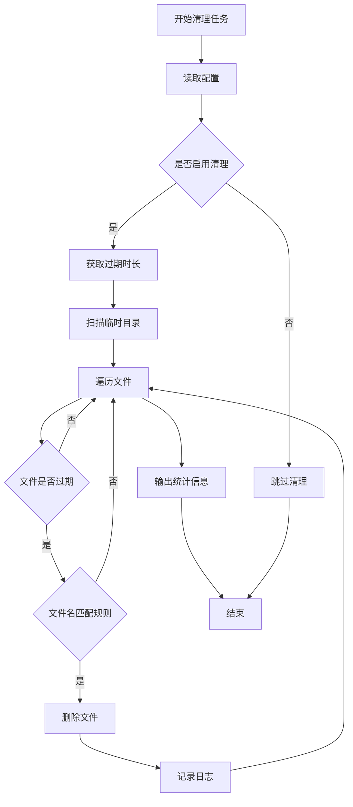
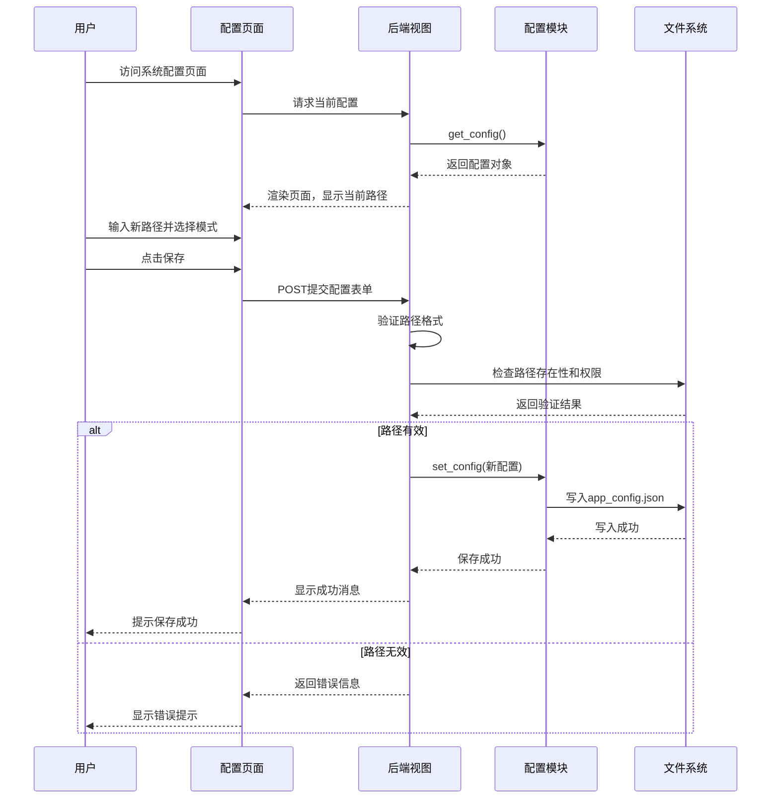
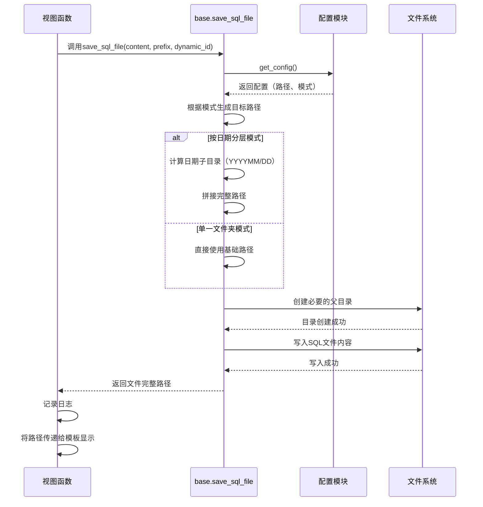
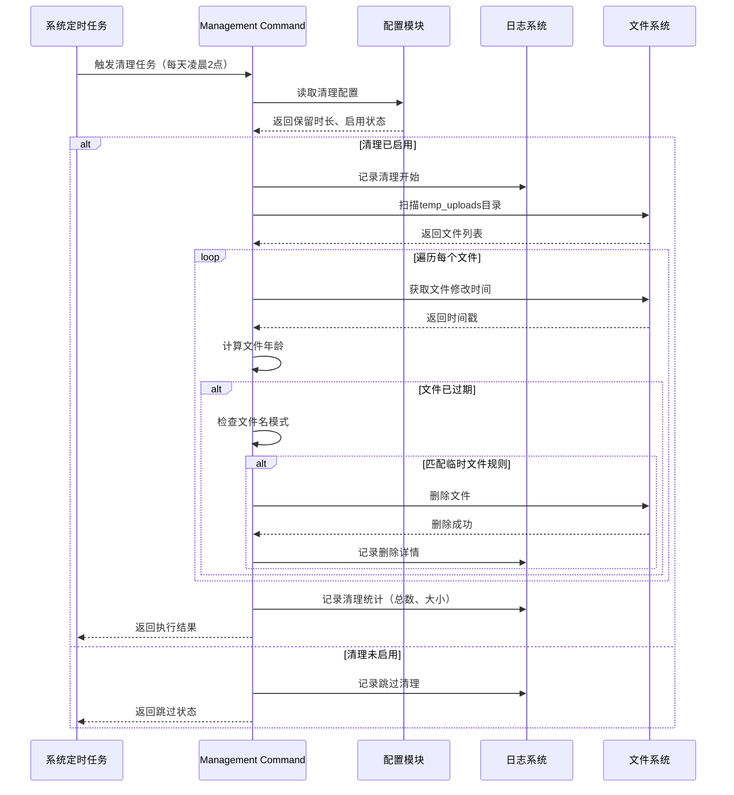
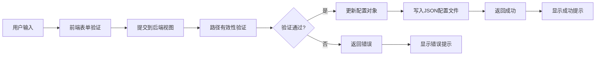
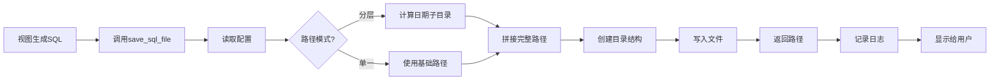

# 临时文件清理与路径配置功能设计

## 一、需求概述

### 1.1 业务背景
当前系统中存在两类文件保存机制：
- **SQL成功文件**：保存到固定路径 `D:\临时文件\{年月}\{日}\*.sql`
- **临时校验失败文件**：保存到 `temp_uploads/validation_failures/` 目录
- **临时导入文件**：保存到 `temp_uploads/` 目录（CSV导入文件）

### 1.2 核心需求
1. **临时文件定时清理**：定期清理过期的临时文件（校验失败文件、导入临时文件等）
2. **SQL文件路径可配置**：支持配置SQL成功文件的生成路径
   - 支持指定到单一文件夹
   - 支持指定到父文件夹，并自动在其下按年月日生成子目录
3. **可视化路径选择**：通过点击按钮选择系统文件夹进行路径配置

## 二、功能设计

### 2.1 临时文件定时清理功能

#### 2.1.1 清理目标
清理以下类型的临时文件：
- 校验失败文件（`temp_uploads/validation_failures/`）
- CSV导入临时文件（`temp_uploads/*.csv`）
- 其他临时上传文件

#### 2.1.2 清理策略

| 配置项 | 说明 | 默认值 |
|--------|------|--------|
| 清理周期 | 定时任务执行间隔 | 每天凌晨2点执行 |
| 文件过期时间 | 文件创建后多久被视为过期 | 24小时 |
| 清理目录列表 | 需要清理的目录 | temp_uploads/validation_failures, temp_uploads（仅CSV） |

#### 2.1.3 清理机制
- 采用基于文件修改时间的过期判断
- 仅删除符合特定命名模式的文件（安全性考虑）
- 记录清理日志（清理文件数量、文件名、清理时间）
- 异常情况不中断整个清理流程

#### 2.1.4 定时任务实现方式

**方案选择**：采用Django内置管理命令 + 系统任务调度器

| 方案 | 优势 | 劣势 | 是否采用 |
|------|------|------|----------|
| Django Management Command + 系统定时任务（crontab/Task Scheduler） | 简单可靠，不依赖额外进程 | 需要配置系统级定时任务 | ✅ 推荐 |
| Django-crontab | 集成度高 | 需要额外依赖 | ❌ |
| Celery | 功能强大 | 过于复杂，需要消息队列 | ❌ |

**实现方式**：
- 创建Django管理命令 `cleanup_temp_files`
- 支持手动执行和定时调度
- 提供命令行参数控制清理行为

### 2.2 SQL文件路径配置功能

#### 2.2.1 路径配置模式

支持两种路径组织模式：

| 模式 | 说明 | 示例 |
|------|------|------|
| 单一文件夹模式 | 所有SQL文件保存到同一文件夹 | `D:\SQL输出\*.sql` |
| 按日期分层模式 | 在父文件夹下按年月日自动创建子目录 | `D:\SQL输出\202512\07\*.sql` |

#### 2.2.2 配置项设计

新增配置项到 `app_config.json`：

| 配置键 | 类型 | 说明 | 默认值 |
|--------|------|------|--------|
| SQL_OUTPUT_BASE_PATH | 字符串 | SQL文件输出的基础路径 | `D:\临时文件` |
| SQL_OUTPUT_MODE | 字符串 | 路径组织模式：`flat`（单一文件夹）或 `hierarchical`（按日期分层） | `hierarchical` |
| SQL_OUTPUT_DATE_FORMAT | 字符串 | 日期子目录格式（仅分层模式有效） | `%Y%m/%d` |

#### 2.2.3 路径生成逻辑

**单一文件夹模式（flat）**：
- 文件保存路径：`{SQL_OUTPUT_BASE_PATH}/{filename}.sql`
- 示例：`D:\SQL输出\contract_price_143025.sql`

**按日期分层模式（hierarchical）**：
- 文件保存路径：`{SQL_OUTPUT_BASE_PATH}/{YYYYMM}/{DD}/{filename}.sql`
- 示例：`D:\临时文件\202512\07\contract_price_143025.sql`

### 2.3 可视化路径配置界面

#### 2.3.1 配置页面集成
扩展现有的 `system_config.html` 页面，新增"文件路径配置"区块

#### 2.3.2 界面组件设计

**配置区块结构**：

```
【文件路径配置】
├─ SQL文件输出路径
│  ├─ [文本输入框：显示当前路径]
│  └─ [选择文件夹] 按钮
│
├─ 路径组织模式
│  ├─ ( ) 单一文件夹模式
│  └─ (•) 按日期分层模式（默认）
│
├─ 日期格式（仅分层模式可用）
│  ├─ ( ) 年月/日 (202512/07)
│  ├─ (•) 年月日 (20251207)
│  └─ ( ) 年/月/日 (2025/12/07)
│
└─ [保存配置] 按钮
```

#### 2.3.3 文件夹选择实现方式

**技术方案**：HTML5 File API + 后端路径验证

| 实现方式 | 技术方案 | 优势 | 劣势 | 是否采用 |
|----------|----------|------|------|----------|
| 浏览器原生文件夹选择 | `<input type="file" webkitdirectory>` | 简单，无需额外依赖 | 浏览器兼容性问题，仅能获取相对路径 | ❌ |
| 手动输入路径 | `<input type="text">` | 简单可靠 | 用户体验较差 | ✅ 主方案 |
| 客户端脚本调用系统对话框 | Electron/PyWebView | 原生体验好 | 需要桌面应用封装 | 🔶 可选增强 |

**采用方案**：手动输入路径 + 路径有效性验证

- 用户在文本框中输入或粘贴路径
- 前端进行基础格式校验
- 后端验证路径是否存在、是否有写权限
- 支持"选择文件夹"按钮提示用户复制路径

#### 2.3.4 配置项临时文件清理设置

在配置页面增加临时文件清理配置：

| 配置项 | 界面控件 | 默认值 |
|--------|----------|--------|
| 自动清理临时文件 | 复选框 | 启用 |
| 文件保留时长（小时） | 数字输入框 | 24 |

## 三、数据模型设计

### 3.1 配置数据结构

扩展 `config/app_config.json` 配置文件：

| 字段路径 | 类型 | 必填 | 说明 |
|----------|------|------|------|
| `SQL_OUTPUT_BASE_PATH` | string | 是 | SQL文件输出基础路径 |
| `SQL_OUTPUT_MODE` | string | 是 | 路径模式：`flat` 或 `hierarchical` |
| `SQL_OUTPUT_DATE_FORMAT` | string | 否 | 日期格式，默认 `%Y%m/%d` |
| `TEMP_FILE_CLEANUP_ENABLED` | boolean | 是 | 是否启用自动清理 |
| `TEMP_FILE_RETENTION_HOURS` | number | 是 | 临时文件保留时长（小时） |

### 3.2 清理日志记录

利用现有日志系统记录清理操作：

| 日志项 | 记录内容 |
|--------|----------|
| 清理开始 | 清理任务启动时间 |
| 扫描结果 | 扫描到的临时文件数量 |
| 清理详情 | 每个被删除文件的路径和过期时长 |
| 清理统计 | 清理文件总数、失败数、总释放空间 |
| 异常信息 | 清理过程中的错误 |

## 四、接口设计

### 4.1 配置管理接口

#### 4.1.1 获取配置
- **用途**：加载当前文件路径配置
- **调用方**：系统配置页面视图
- **返回数据**：包含完整配置的字典对象

#### 4.1.2 保存配置
- **用途**：更新文件路径配置
- **输入数据**：用户提交的配置表单
- **验证项**：
  - 路径是否为有效的绝对路径
  - 路径是否存在或可创建
  - 路径是否有写权限
  - 数值参数是否在合理范围内

#### 4.1.3 验证路径
- **用途**：验证用户输入的路径有效性
- **验证逻辑**：
  - 检查路径格式是否合法
  - 检查路径是否存在
  - 检查是否有读写权限
  - 尝试创建测试文件验证可写性
- **返回结果**：验证状态、错误信息

### 4.2 文件保存接口

#### 4.2.1 重构 save_sql_file 函数
- **原有逻辑**：固定保存到 `D:\临时文件\{年月}\{日}\`
- **新逻辑**：
  - 从配置中读取 `SQL_OUTPUT_BASE_PATH` 和 `SQL_OUTPUT_MODE`
  - 根据配置模式生成目标路径
  - 自动创建必要的子目录
  - 保存文件并返回完整路径

#### 4.2.2 路径生成策略

| 输入参数 | 说明 |
|----------|------|
| sql_content | SQL文件内容 |
| prefix | 文件名前缀（如 `contract_price`） |
| dynamic_id | 动态标识符（可选） |

**输出路径生成流程**：
1. 读取配置获取基础路径和模式
2. 根据模式决定是否添加日期子目录
3. 组合文件名（`{dynamic_id}_{prefix}.sql` 或 `{prefix}_{timestamp}.sql`）
4. 拼接完整路径
5. 创建必要的父目录
6. 返回最终文件路径

### 4.3 清理任务接口

#### 4.3.1 Management Command
- **命令名**：`cleanup_temp_files`
- **参数选项**：

| 参数 | 类型 | 说明 | 默认值 |
|------|------|------|--------|
| `--hours` | 整数 | 文件过期时长（小时） | 从配置读取 |
| `--dry-run` | 标志 | 模拟运行，不实际删除 | False |
| `--verbose` | 标志 | 显示详细日志 | False |

#### 4.3.2 清理执行流程



## 五、业务流程设计

### 5.1 配置路径流程



### 5.2 SQL文件保存流程



### 5.3 定时清理流程



## 六、界面设计

### 6.1 系统配置页面扩展

在现有 `system_config.html` 页面底部增加新配置区块：

#### 6.1.1 文件路径配置区块

**区块标题**：文件路径配置

**表单字段**：

| 字段标签 | 控件类型 | 验证规则 |
|----------|----------|----------|
| SQL文件输出路径 | 文本输入框（只读）+ 路径输入对话提示 | 必填，绝对路径 |
| 路径组织模式 | 单选按钮组 | 必选 |
| 日期格式 | 单选按钮组（条件显示） | 仅分层模式必选 |

**操作按钮**：
- 保存配置（主按钮）
- 取消修改（次要按钮）

#### 6.1.2 临时文件清理配置区块

**区块标题**：临时文件清理

**表单字段**：

| 字段标签 | 控件类型 | 默认值 | 验证规则 |
|----------|----------|--------|----------|
| 启用自动清理 | 复选框 | 选中 | - |
| 文件保留时长 | 数字输入框 + 单位（小时） | 24 | 1-168（1小时至7天） |
| 立即执行清理 | 操作按钮 | - | 触发清理任务 |

#### 6.1.3 页面交互逻辑

**路径模式切换**：
- 选择"单一文件夹模式"时，隐藏日期格式选项
- 选择"按日期分层模式"时，显示日期格式选项

**路径输入辅助**：
- 提供占位符提示：`例如：D:\SQL输出`
- 提供路径复制提示：`请从文件资源管理器复制完整路径`

**保存验证反馈**：
- 路径不存在：警告提示"路径不存在，将自动创建"
- 路径无权限：错误提示"路径无写入权限，请选择其他路径"
- 保存成功：成功提示（3秒后自动消失）

**立即清理反馈**：
- 点击"立即执行清理"后弹出确认对话框
- 清理完成后显示结果统计：`已清理 X 个文件，释放空间 Y MB`

### 6.2 页面布局示意

```
┌─────────────────────────────────────────┐
│ 系统配置                                 │
├─────────────────────────────────────────┤
│ SQL合并策略                              │
│ [现有配置区块...]                        │
│                                          │
├─────────────────────────────────────────┤
│ 文件路径配置                             │
│                                          │
│ SQL文件输出路径                          │
│ [D:\临时文件                    ] [💡提示]│
│                                          │
│ 路径组织模式                             │
│ ○ 单一文件夹模式                         │
│ ● 按日期分层模式                         │
│                                          │
│ 日期格式（仅分层模式）                   │
│ ○ 年月/日 (202512/07)                   │
│ ● 年月日 (20251207)                     │
│ ○ 年/月/日 (2025/12/07)                 │
│                                          │
│ [保存配置]                               │
│                                          │
├─────────────────────────────────────────┤
│ 临时文件清理                             │
│                                          │
│ ☑ 启用自动清理                           │
│                                          │
│ 文件保留时长  [24] 小时                  │
│                                          │
│ [立即执行清理]                           │
│                                          │
└─────────────────────────────────────────┘
```

## 七、技术实现要点

### 7.1 配置模块扩展

**修改 `config.py` 的 DEFAULT 配置**：

新增默认配置项：
- `SQL_OUTPUT_BASE_PATH`：默认 `D:\临时文件`
- `SQL_OUTPUT_MODE`：默认 `hierarchical`
- `SQL_OUTPUT_DATE_FORMAT`：默认 `%Y%m/%d`
- `TEMP_FILE_CLEANUP_ENABLED`：默认 `True`
- `TEMP_FILE_RETENTION_HOURS`：默认 `24`

### 7.2 路径验证工具函数

**功能职责**：验证用户输入的路径有效性

**验证项**：
1. 路径格式校验（绝对路径、特殊字符过滤）
2. 路径存在性检查
3. 权限检查（可读、可写）
4. 磁盘空间检查（可选）

**返回结构**：

| 字段 | 类型 | 说明 |
|------|------|------|
| valid | 布尔值 | 是否有效 |
| error | 字符串 | 错误信息（有效时为空） |
| warning | 字符串 | 警告信息（如路径不存在但可创建） |

### 7.3 文件保存逻辑重构

**重构 `views/base.py` 中的 `save_sql_file` 函数**：

**改造前**：
- 硬编码基础路径 `D:\临时文件`
- 固定使用日期分层结构 `{YYYYMM}/{DD}/`

**改造后**：
- 从配置读取基础路径和模式
- 根据配置动态选择路径生成策略
- 保持向后兼容（配置不存在时使用默认值）

### 7.4 清理任务实现

#### 7.4.1 Management Command 创建

**文件位置**：`work_tools/management/commands/cleanup_temp_files.py`

**核心功能**：
- 继承 `BaseCommand`
- 实现 `handle` 方法
- 支持命令行参数
- 输出清理进度和统计

#### 7.4.2 清理目标定义

**临时文件识别规则**：

| 目录 | 文件模式 | 说明 |
|------|----------|------|
| `temp_uploads/validation_failures/` | `validation_failed_*.xlsx` | 校验失败文件 |
| `temp_uploads/` | `*.csv` | CSV导入临时文件 |
| `temp_uploads/` | `tmp*.csv` | tempfile生成的临时文件 |

**排除规则**：
- 不清理非临时文件（如配置文件、文档）
- 不清理未过期文件

#### 7.4.3 安全保障措施

- 仅删除符合特定模式的文件
- 删除前二次确认文件过期时间
- 捕获删除异常，避免中断整个流程
- 记录详细的删除日志便于追溯

### 7.5 定时任务配置

#### 7.5.1 Windows 系统（Task Scheduler）

**任务配置**：
- 触发器：每天凌晨 2:00
- 操作：运行 Python 脚本
- 命令：`python manage.py cleanup_temp_files`
- 工作目录：项目根目录

#### 7.5.2 Linux/macOS 系统（crontab）

**Cron 表达式**：
```
0 2 * * * cd /path/to/work_tools && python manage.py cleanup_temp_files
```

## 八、数据流图

### 8.1 配置保存数据流



### 8.2 文件保存数据流



## 九、异常处理策略

### 9.1 配置保存异常

| 异常场景 | 处理策略 | 用户提示 |
|----------|----------|----------|
| 路径格式非法 | 拦截保存，返回错误 | "路径格式不正确，请输入有效的绝对路径" |
| 路径不存在 | 尝试创建，创建失败则拦截 | "无法创建目录，请检查路径是否正确" |
| 无写入权限 | 拦截保存，返回错误 | "路径无写入权限，请选择其他位置" |
| JSON写入失败 | 回滚配置，记录日志 | "保存配置失败，请稍后重试" |

### 9.2 文件保存异常

| 异常场景 | 处理策略 | 降级方案 |
|----------|----------|----------|
| 配置路径不可用 | 回退到默认路径 | 使用 `D:\临时文件` |
| 磁盘空间不足 | 抛出明确异常 | 提示用户清理空间或更换路径 |
| 目录创建失败 | 抛出异常，终止保存 | 在UI显示错误 |
| 文件写入失败 | 抛出异常 | 提示重试或检查权限 |

### 9.3 清理任务异常

| 异常场景 | 处理策略 | 日志记录 |
|----------|----------|----------|
| 目录不存在 | 跳过清理该目录 | WARNING级别 |
| 文件删除失败 | 记录但继续处理其他文件 | ERROR级别，记录文件路径 |
| 权限不足 | 跳过该文件 | WARNING级别 |
| 配置读取失败 | 使用默认配置值 | WARNING级别 |

## 十、测试策略

### 10.1 配置功能测试

| 测试场景 | 预期结果 |
|----------|----------|
| 配置有效路径并保存 | 配置成功保存到JSON文件 |
| 输入不存在的路径 | 显示警告，尝试创建 |
| 输入无权限的路径 | 显示错误，拒绝保存 |
| 切换路径模式 | 界面联动正确，配置正确更新 |
| 修改日期格式 | 新生成文件使用新格式 |

### 10.2 文件保存测试

| 测试场景 | 预期结果 |
|----------|----------|
| 单一文件夹模式保存 | 文件保存到基础路径根目录 |
| 分层模式保存 | 文件保存到日期子目录 |
| 配置路径不存在 | 自动创建必要目录 |
| 配置文件损坏 | 回退到默认配置 |
| 动态ID文件命名 | 文件名包含动态ID |

### 10.3 清理任务测试

| 测试场景 | 预期结果 |
|----------|----------|
| 执行清理命令（dry-run） | 输出统计，不实际删除 |
| 清理过期文件 | 仅删除超过保留时长的文件 |
| 清理未启用 | 任务跳过，记录日志 |
| 清理空目录 | 正常完成，输出0条记录 |
| 部分文件删除失败 | 其余文件继续处理 |

### 10.4 集成测试

| 测试场景 | 验证点 |
|----------|--------|
| 更改配置后生成SQL | 文件保存到新路径 |
| 定时任务执行 | 清理日志正确记录 |
| 配置恢复默认值 | 功能回退到原始行为 |

## 十一、部署说明

### 11.1 配置文件迁移

**步骤**：
1. 备份现有 `config/app_config.json`
2. 系统自动合并新配置项到现有配置
3. 首次加载使用默认值

### 11.2 定时任务部署

#### Windows 环境

**手动配置步骤**：
1. 打开"任务计划程序"
2. 创建基本任务
3. 设置触发器：每天 02:00
4. 设置操作：启动程序
   - 程序：`python.exe` 的完整路径
   - 参数：`manage.py cleanup_temp_files`
   - 起始于：项目根目录

#### Linux/macOS 环境

**配置 crontab**：
```
crontab -e
```
添加行：
```
0 2 * * * cd /path/to/work_tools && /path/to/python manage.py cleanup_temp_files >> /path/to/logs/cleanup.log 2>&1
```

### 11.3 权限检查

**部署前验证**：
- 配置目录可写
- 默认SQL输出路径可创建
- 临时目录可读写删除
- 日志目录可写

## 十二、运维监控

### 12.1 监控指标

| 指标 | 监控方式 | 告警阈值 |
|------|----------|----------|
| 清理任务执行状态 | 日志监控 | 连续3天未执行 |
| 清理文件数量 | 日志统计 | - |
| 临时目录空间占用 | 磁盘监控 | > 1GB |
| 配置文件完整性 | 启动检查 | 配置加载失败 |

### 12.2 日志查看

**清理日志位置**：`logs/work_tools.log`

**关键日志标识**：
- `[清理任务]`：清理任务相关日志
- `[配置保存]`：配置更新日志
- `[文件保存]`：SQL文件保存日志

### 12.3 故障排查

| 问题现象 | 排查步骤 |
|----------|----------|
| SQL文件未保存到配置路径 | 检查配置文件、路径权限、日志错误 |
| 临时文件未清理 | 检查定时任务状态、清理配置、日志 |
| 配置保存失败 | 检查配置文件权限、JSON格式、日志 |

## 十三、设计决策记录

### 13.1 为什么选择文件系统定时任务而非 Celery

**理由**：
- 项目规模较小，无需引入消息队列复杂性
- 清理任务频率低（每天一次），系统定时任务足够
- 减少运行时依赖和维护成本

### 13.2 为什么不使用 Web 文件夹选择器

**理由**：
- 浏览器文件系统 API 受限（安全沙箱）
- 无法直接获取系统绝对路径
- 手动输入+验证方案更可靠

### 13.3 为什么保留日期分层作为默认模式

**理由**：
- 便于按时间查找和归档
- 避免单一目录文件过多
- 符合现有用户习惯

## 十四、后续优化方向

### 14.1 功能增强
- 支持路径变量（如 `{YEAR}/{MONTH}/{DAY}`）
- 清理任务执行历史记录
- 文件归档功能（压缩旧文件）

### 14.2 体验优化
- 路径选择对话框（Electron封装）
- 配置导入导出功能
- 清理任务手动触发界面

### 14.3 性能优化
- 大文件清理分批处理
- 清理任务并发执行
- 智能清理（根据磁盘空间动态调整）
